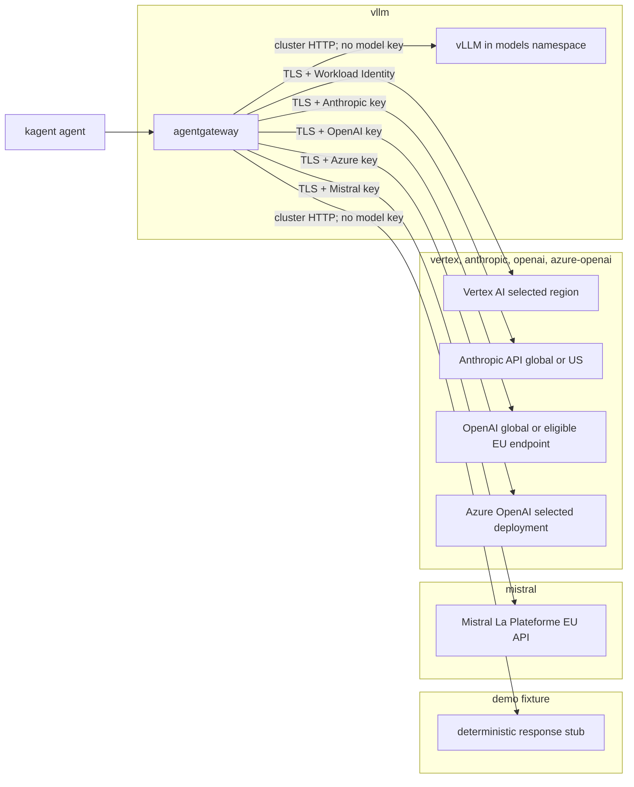

# Model Provider Profiles (D16)

Fgentic keeps model choice at the cluster boundary: agents call the same in-cluster OpenAI-compatible endpoint, while the selected agentgateway profile owns the model endpoint and any credential. This implements [D16](design-decisions.md#d16--sovereign-model-profiles-decided-2026-07-11-implementation-milestone-m1) without giving model credentials to kagent or the bridge.

## Select a profile

Set `llm_provider` and `llm_model` in `clusters/<env>/platform-settings.yaml`, then run `scripts/gen-secrets.sh <server_name> <env>`. The generator emits only the selected API provider's SOPS Secret; Vertex continues to use Workload Identity on GKE or the cluster-only ADC helper on k3d, and self-hosted vLLM needs no model credential.

| `llm_provider` | Additional setting      | Credential environment variable | Secret name           | Prometheus `gen_ai_system` |
| -------------- | ----------------------- | ------------------------------- | --------------------- | -------------------------- |
| `demo`         | evaluation overlay only | none                            | none                  | `openai`                   |
| `vllm`         | none                    | none                            | none                  | `openai`                   |
| `vertex`       | `vertex_region`         | none                            | `gcp-adc` on k3d only | `gcp.vertex_ai`            |
| `mistral`      | none                    | `MISTRAL_API_KEY`               | `mistral-secret`      | `openai`                   |
| `anthropic`    | none                    | `ANTHROPIC_API_KEY`             | `anthropic-secret`    | `anthropic`                |
| `openai`       | `openai_host`           | `OPENAI_API_KEY`                | `openai-secret`       | `openai`                   |
| `azure-openai` | `azure_openai_resource` | `AZURE_OPENAI_API_KEY`          | `azure-openai-secret` | `azure`                    |

Every API-key Secret is namespace-local to `agentgateway-system` and stores the raw key under the literal data key `Authorization`. This is the [agentgateway v1.3.1 Secret resolver contract](https://github.com/agentgateway/agentgateway/blob/v1.3.1/controller/pkg/utils/kubeutils/secrets.go#L116-L125); the gateway inserts the required upstream header. Do not add `Bearer` in the SOPS input.

`demo` is a deterministic OpenAI-compatible response stub used only by `clusters/demo` and `mise run demo:up`. It proves protocol wiring without a model account, prompt egress, or token charge; it cannot reason and is not a D16 production model profile. The `local` and `gcp` overlays cannot select it accidentally through their tracked defaults.

## Governed model catalog

[`infra/agentgateway/providers/model-catalog.yaml`](../infra/agentgateway/providers/model-catalog.yaml) is the single declarative inventory for each approved exact `(gen_ai_system, model)` identity. Its [JSON Schema](../infra/agentgateway/providers/model-catalog.schema.json) and typed `check:model-catalog` validator require:

1. One existing agentgateway `profile` and exact model identity, with no duplicate metric or profile/model key.
1. `residency` as `self-hosted`, `eu`, or `global`.
1. `allowedClassification` as the highest approved room-data class: `public`, `approved_non_public`, `restricted`, or `regulated`. This ceiling is not an authorization grant. Secret and authentication material are never model input.
1. One or more `chat`, `embeddings`, or `rerank` capabilities.
1. At most one `costRef`, fixed to the operator-reviewed `fgentic.eval.pricing.v1` overlay identity. The catalog contains no mutable price or price URL.

The root check resolves every tracked `clusters/*/platform-settings.yaml` provider/model pair through the catalog and fails closed on an unknown selection, missing classification, unsupported enum, duplicate identity, or missing provider directory. It additionally requires each overlay's `model_allowed_classification` to equal the governed catalog ceiling for its selected profile/model, so the residency ceiling substituted into the gateway policy (below) can never silently widen past the catalog. The current inventory covers the tracked `demo` and `vertex` choices, the canonical self-hosted `vllm` chat model, and the opt-in self-hosted `embeddings` profile's two governed models (`BAAI/bge-m3` with the `embeddings` capability and `BAAI/bge-reranker-v2-m3` with the `rerank` capability, sharing one provider directory). Before selecting a different API model or adding an embeddings/rerank backend, add its exact reviewed entry in the same change; do not copy residency or classification fields into an overlay or route.

### Classification/residency-aware routing (#339)

The catalog is policy input; agentgateway owns the enforcement. The classification-aware denial path is now live and fail-closed:

1. **Trusted signal at the bridge boundary.** The bridge forwards each mapping's reviewed `dataClassification` as the `X-Fgentic-Data-Classification` request header on the local A2A/LLM path (delegation, continuation, poll/cancel, and AgentCard fetch). It is derived from trusted `agents.yaml` config, not from room content, and defaults to the most-restrictive class (`regulated`) when unset or unknown, so a room can never spoof or lower it. Remote mappings reject the field and never emit the header.
1. **Enforcement at the egress chokepoint.** The [`a2a-bridge-authorization`](../infra/agentgateway/a2a-authorization.yaml) policy is a single fail-closed `Require` CEL expression that `&&`-joins the workload rule with a residency clause comparing the forwarded classification rank to the selected model's ceiling rank (one `&&`-joined expression, matching every other policy in the repo, so there is no ambiguity in how multiple list elements would combine). The ceiling is the per-cluster `model_allowed_classification` substituted from `platform-settings` (cross-checked against the catalog by `check:model-catalog`). A delegation whose class exceeds the ceiling is denied before it reaches kagent — that is, before any model egress. Because kagent's `X-User-Id` is attribution, not authentication (D11), enforcement must sit at this gateway the room cannot spoof past, never inside kagent.
1. **Fail-closed on both sides.** A present-but-unknown header **value** ranks as the most sensitive class (`regulated`), while a **missing** header makes the CEL error on the absent key and is therefore denied outright under every ceiling (verified against the real agentgateway v1.3.1 via `test:model-residency --runtime` — a header-less request has bypassed the bridge's classification, so denying it is correct, D11); an unknown or unsubstituted ceiling ranks as the most restrictive ceiling (`public`); any CEL evaluation error denies (`Require`). Drift therefore denies rather than leaks. With the default `vertex` profile (ceiling `public`), only public-classified rooms are served and any higher class is denied; selecting the sovereign `vllm` profile (ceiling `regulated`) admits classified rooms to the self-hosted backend.
1. **Load-bearing NetworkPolicy backstop.** While the sovereign `vllm` profile is selected, `agentgateway-vllm-egress` restricts the proxy to in-cluster dependencies only (no `ipBlock`/public-internet egress) and the `models` namespace is default-deny egress, so a classified route has no reachable external-provider path even if the CEL were bypassed. The CEL deny is the primary control; this policy is the backstop.

`check:model-residency` (`scripts/test-model-residency.sh`) proves this offline and deterministically. It does not rely on substring checks or a Go re-implementation: it extracts the exact shipped CEL expression and compiles + evaluates it with `cel-go` against a fixture request matrix with the ceiling substituted as Flux would, so an inverted or weakened comparison that admits classified content to a hyperscaler makes the gate FAIL. It also proves the single-expression fold, the fail-closed missing-header divergence (cel-go errors where agentgateway returns null; both deny under a public ceiling), the sovereign backstop NetworkPolicy, and a governed `modelcatalog.Admits` cross-check. `test:model-residency` additionally evaluates the real pinned agentgateway CEL — with strict API-key auth and the classification header — against fixture requests in Docker.

## Sovereign LLM-as-judge scoring lane (#355)

The `eval:models` harness can optionally score the qualitative (`optional_llm_judge`) scenarios for groundedness and task success instead of leaving them unscored. The judge model is **composed** from the self-hosted `vllm` profile reached over the existing A2A/agentgateway route — it is not a Fgentic-built scorer, and no evaluator holds a model credential. The judge is invoked as an ordinary kagent Agent (`--judge-agent`, default `sovereign-judge`), so eval prompts and agent outputs never leave the cluster.

The lane is opt-in (`mise run eval:models -- --judge …`) and fail-safe:

1. **Approved-profile guard.** The judge lane runs only when the run's catalog model is `residency: self-hosted`; selecting a metered `eu`/`global` provider blocks it, so a judge invocation can never egress eval data to an external model. The guard is enforced in the Go runner, not just the wrapper script.
1. **Parse at the boundary.** The judge must return exactly `{"groundedness": <0..1>, "task_success": <0..1>, "rationale": "…"}`; strict decoding fails closed on any extra prose, missing field, wrong type, or out-of-range score. A malformed or missing judge answer **fails the scenario**, never silently passes it. A judge transport failure aborts the run like any scenario call failure.
1. **Payload-free evidence.** Only the two bounded scores are recorded (`judge_scores` in the report); the judge rationale, prompt, and agent output are never persisted, logged, or metered. Thresholds are operator-set (`--judge-min-groundedness`, `--judge-min-task-success`).

## Data-flow map by profile

Every agent uses the same in-cluster route. The selected profile changes only the final model hop; credentials terminate at agentgateway and never enter kagent or the bridge.



The diagram shows one mutually exclusive deployment choice, not simultaneous fan-out. API-provider account settings still control retention, contractual residency, and deployment geography.

| Profile        | Cost characteristic                                                                                      | Latency expectation                                                                                         |
| -------------- | -------------------------------------------------------------------------------------------------------- | ----------------------------------------------------------------------------------------------------------- |
| `demo`         | No provider or per-token bill; a tiny disposable-cluster workload.                                       | Deterministic fixture latency only; not representative of model inference.                                  |
| `vllm`         | Fixed cluster CPU/GPU and storage cost even when idle; no per-token provider bill.                       | Slow on the reference CPU model; GPU serving is normally faster but materially more expensive.              |
| `mistral`      | Usage-metered API; exact currency cost depends on the selected model and current account contract.       | Internet round trip to the EU service plus model generation; usually faster than the reference CPU vLLM.    |
| `vertex`       | Usage-metered API plus any GCP network/observability charges; account billing is the source of truth.    | Region-dependent internet/cloud hop; the tracked Gemini profile is the currently verified quality baseline. |
| `anthropic`    | Usage-metered API; prompt caching and model choice can materially change token charges.                  | Global or US inference path plus model generation; no EU-only direct route is claimed.                      |
| `openai`       | Usage-metered API; regional eligibility, storage controls, and model tier affect the commercial posture. | Global or eligible EU endpoint round trip; service tier and model dominate tail latency.                    |
| `azure-openai` | Azure consumption under the chosen deployment/SKU; Global, Data Zone, and Regional capacity differ.      | Selected Azure deployment and capacity determine geography, queueing, and tail latency.                     |

Fgentic records provider/model token dimensions but intentionally ships no mutable web-price catalog. The governed model catalog's optional `costRef` names only the accepted pricing-overlay schema; it contains no rate. Compare currency cost through the provider invoice or a versioned organization-owned catalog; never infer an audited cost by multiplying tokens by an unversioned price.

## Default profile decision (2026-07-14)

The tracked overlays deliberately have two defaults because protocol evaluation and a production-shaped model boundary have different prerequisites:

| Overlay          | Purpose                             | Tracked provider and model           | Credential boundary                                                                                                     |
| ---------------- | ----------------------------------- | ------------------------------------ | ----------------------------------------------------------------------------------------------------------------------- |
| `clusters/demo`  | Out-of-the-box protocol evaluation  | `demo` / `fgentic-demo`              | None; deterministic in-cluster fixture                                                                                  |
| `clusters/local` | Production-shaped local development | `vertex` / `google/gemini-2.5-flash` | Cluster-only `gcp-adc` Secret consumed only by agentgateway                                                             |
| `clusters/gcp`   | Production-shaped GKE reference     | `vertex` / `google/gemini-2.5-flash` | Direct agentgateway Workload Identity grant; live proof remains in [#59](https://github.com/fmind-ai/fgentic/issues/59) |

Vertex is the pragmatic default for the production-shaped references because it is the verified quality path and can use the maintainer's existing GCP credits. It is **not sovereign-by-default**: complete requests and responses cross the cluster boundary to Google, usage is billed to the selected project, and the project region, account contract, retention settings, and provider-side processing remain operator controls. The credential stays at agentgateway; no Agent, bridge, or Matrix service receives it.

Keep `demo` for credential-free integration evaluation. Select `vllm` when serving-time prompts and responses must stay in the cluster, accepting its download, RAM, latency, and model-quality trade-offs. Mistral and the other API profiles remain explicit operator choices rather than hidden quickstart defaults.

## Data flow and residency

Selecting an API profile sends the complete model request and response from agentgateway to that provider over verified TLS. A profile controls the network endpoint; it cannot prove account-level contracts, retention settings, deployment types, or where provider-side tools send data. Confirm those controls with the provider before sending regulated content.

### Self-hosted vLLM

Set `llm_provider: vllm` and `llm_model: Qwen/Qwen2.5-0.5B-Instruct`. The selected provider inventory deploys the official [vLLM Production Stack chart 0.1.11](https://github.com/vllm-project/production-stack/releases/tag/vllm-stack-0.1.11), the multi-architecture CPU runtime `vllm/vllm-openai-cpu:v0.25.1@sha256:6b301f040db8152dfb8ff55e06fd348aa5d0d9a311f58118160c7058262c8628`, and the public Qwen model at immutable revision `7ae557604adf67be50417f59c2c2f167def9a775`. The chart, runtime, and model are Apache-2.0.

A one-shot loader writes the approximately 1 GB model snapshot to a 3 GiB PVC. Only that prompt-free Job may reach public HTTPS; the serving Pod mounts the cache read-only, enables Hugging Face and vLLM offline/telemetry-off modes, and receives no egress allowance. Agentgateway's vLLM-profile policy additionally limits its proxy to cluster DNS, its XDS control plane, vLLM, and kagent. The loader's public TCP 443 rule is necessarily address-based because portable Kubernetes NetworkPolicy cannot allow an HTTPS FQDN and its CDN aliases.

The loader accepts only a full lowercase Git revision and stages each download in a fresh hidden snapshot directory. After `snapshot_download` succeeds, it writes `.ready` as `snapshot-v2:<revision>`, creates a relative serving symlink, and atomically replaces the public model path. A failed download or publication preserves the last published snapshot, and a later retry restores an interrupted legacy-directory migration before downloading again. Superseded snapshots and legacy staging are removed only after a new snapshot is published and validated, so a revision change cannot leave stale files from the previous pin in the serving tree.

The reference is deliberately small: 2 CPU/4 GiB requested, 4 CPU/6 GiB limited, 1 GiB KV cache, 4K context, and one concurrent sequence. `Qwen2.5-0.5B-Instruct` makes local sovereignty demonstrable, not production model quality: expect slow CPU generation and materially weaker answers than the API defaults. A useful 7B/8B model needs roughly 14–16 GB for BF16 weights plus runtime/KV memory and normally a 24 GB GPU; an always-on cloud GPU would exceed the project's USD 85/month ceiling, so the GCP reference stays on Vertex.

#### GPU production override

Keep the tracked CPU profile unchanged. A GPU deployment is an environment-owned Flux patch against the selected `agentgateway-provider`, not a second default. The following statically rendered example targets one NVIDIA L4-class GPU with 24 GiB VRAM and `Qwen/Qwen2.5-7B-Instruct` at immutable revision `a09a35458c702b33eeacc393d103063234e8bc28`.

Patch the existing `spec.values.servingEngineSpec.modelSpec[0]` fields individually; do not replace the whole item and lose its service account, hardened contexts, offline environment, or read-only mounts:

```yaml
name: qwen2-5-7b
repository: vllm/vllm-openai
tag: v0.24.0@sha256:251eba5cc7c12fed0b75da22a9240e582b1c9e39f6fbc064f86781b963bd814f
modelURL: /models/qwen2.5-7b-instruct
runtimeClassName: ""
resources:
  requests:
    cpu: "2"
    memory: 8Gi
    nvidia.com/gpu: "1"
  limits:
    cpu: "4"
    memory: 12Gi
    nvidia.com/gpu: "1"
shmSize: 4Gi
vllmConfig:
  enablePrefixCaching: false
  enableChunkedPrefill: false
  maxModelLen: 4096
  dtype: bfloat16
  tensorParallelSize: 1
  maxNumSeqs: 4
  gpuMemoryUtilization: 0.90
  extraArgs:
    - --served-model-name
    - ${llm_model}
    - --no-enable-log-requests
extraVolumes:
  - name: model-cache
    persistentVolumeClaim:
      claimName: qwen2-5-7b-model
  - name: runtime-tmp
    emptyDir:
      sizeLimit: 2Gi
```

The paired cache and routing changes are mandatory:

1. Resize and rename the PVC to `qwen2-5-7b-model` with `25Gi`; the StorageClass must let the CPU loader detach and the GPU node attach it.
1. Keep the pinned CPU loader image and its no-token boundary, but download `Qwen/Qwen2.5-7B-Instruct` at revision `a09a35458c702b33eeacc393d103063234e8bc28` into a fresh revision-isolated snapshot for `/models/qwen2.5-7b-instruct`. Set its deadline to `5400`, request `100m` CPU/`256Mi`, limit it to 1 CPU/1 GiB, and atomically publish the relative serving symlink only after writing `snapshot-v2:a09a35458c702b33eeacc393d103063234e8bc28` to `.ready`.
1. Point the engine init-container marker and model mount at the new path and claim. Use the pinned GPU image above for the init container, allow it up to 3,600 seconds to observe the exact versioned marker, and keep both model mounts read-only.
1. Set `llm_model` to `Qwen/Qwen2.5-7B-Instruct`, change the backend host to `vllm-qwen2-5-7b-engine-service.models.svc.cluster.local`, and update the NetworkPolicy probe's expected Service name.
1. Raise the HelmRelease timeout from `30m` to `90m` and the `agentgateway-provider` Flux timeout from `45m` to at least `90m`; a first 15+ GiB model download must not look like a failed rollout.

The GPU runtime remains operator-owned. An `nvidia.com/gpu` request is the portable scheduling constraint; leave `runtimeClassName` empty when NVIDIA is the node default, or set `nvidia` only after `kubectl get runtimeclass nvidia` succeeds. Accelerator labels such as `cloud.google.com/gke-accelerator: nvidia-l4`, taints/tolerations, driver and device-plugin installation, quantization, context/concurrency limits, node autoscaling, quota, and spend depend on the target cluster. Verify that the pinned multi-platform image resolves for the node architecture before rollout; use an architecture-specific digest if the runtime cannot select from its manifest list.

Materialize the fully merged Helm values—not only the fragment above—at `.agents/tmp/vllm-gpu-values.yaml`, then validate the exact pinned chart render:

```bash
export llm_model=Qwen/Qwen2.5-7B-Instruct

mise exec -- flux envsubst --strict < .agents/tmp/vllm-gpu-values.yaml \
  | mise exec -- helm template vllm vllm-stack \
      --repo https://vllm-project.github.io/production-stack \
      --version 0.1.11 \
      --namespace models \
      --values - \
  | tee .agents/tmp/vllm-gpu-render.yaml \
  | mise exec -- kubeconform -strict -summary

mise exec -- yq -e '
  select(.kind == "Deployment") |
  .spec.template.spec.containers[0].image ==
    "vllm/vllm-openai:v0.24.0@sha256:251eba5cc7c12fed0b75da22a9240e582b1c9e39f6fbc064f86781b963bd814f" and
  .spec.template.spec.containers[0].resources.requests."nvidia.com/gpu" == "1" and
  .spec.template.spec.containers[0].resources.limits."nvidia.com/gpu" == "1" and
  (.spec.template.spec.containers[0].command |
    contains(["/models/qwen2.5-7b-instruct", "--gpu_memory_utilization", "0.9"]))
' .agents/tmp/vllm-gpu-render.yaml
```

This proves rendering, schema validity, and the intended image/resource/command contract only. Live CUDA discovery, model loading, `/health`, direct and agentgateway chat, mention-to-reply, metrics, and NetworkPolicy denial evidence require a funded GPU environment and remain human acceptance work for issue #10.

The current constrained k3d host is not runtime acceptance evidence: it lacks safe memory headroom, and repo-owned k3d servers disable kube-router because this host aborts policy synchronization with `iptables-restore: Message too large`. Do not download the large artifacts merely for static validation or claim “prompts never leave” until the full NetworkPolicy conformance probe and mention-to-reply capture pass on a verified policy engine.

### Sovereign embeddings and reranker (M25 grounding, #340)

Grounding/RAG (M25), memory, and the LLM-judge eval (M30) need embeddings and reranking without handing a credential to a caller or sending document content to a hosted API. The opt-in `embeddings` provider profile serves both in-cluster, behind the same credential-free agentgateway chokepoint and token-metering path as chat. It is **orthogonal to the chat `llm_provider`**: enable it whenever a consumer needs in-cluster embeddings, regardless of which chat backend is selected.

The profile is out of the default reconciled DAG. The `agentgateway-embeddings` Flux Kustomization renders [`infra/agentgateway/providers/profiles/embeddings/disabled`](../infra/agentgateway/providers/profiles/embeddings/disabled) (zero objects) until a cluster overlay patches its final path segment to `.../embeddings/enabled`:

```yaml
# clusters/<env>/kustomization.yaml — opt in to the sovereign embeddings runtime
patches:
  - target:
      kind: Kustomization
      name: agentgateway-embeddings
    patch: |
      - op: replace
        path: /spec/path
        value: ./infra/agentgateway/providers/profiles/embeddings/enabled
```

Enabling the profile alongside an **external** chat provider (Vertex/Anthropic/OpenAI/Azure/Mistral) requires operator care: those providers ship no proxy egress policy, so the additive `agentgateway-embeddings-egress` policy flips the proxy to default-deny egress. Pair it with a self-hosted chat provider (`vllm`) or extend the provider-egress inventory (#339) to permit the external chat endpoint too. See "Fail-closed reachability" below.

The enabled profile deploys the vLLM Production Stack chart `0.1.11` and CPU runtime `vllm/vllm-openai-cpu:v0.25.1@sha256:6b301f040db8152dfb8ff55e06fd348aa5d0d9a311f58118160c7058262c8628` (both Apache-2.0) as two engines under `infra/models/embeddings/`:

| Engine                 | Model                     | Revision                                   | License    | vLLM runner       | Endpoints                     |
| ---------------------- | ------------------------- | ------------------------------------------ | ---------- | ----------------- | ----------------------------- |
| `knowledge-embeddings` | `BAAI/bge-m3`             | `5617a9f61b028005a4858fdac845db406aefb181` | MIT        | `pooling` (embed) | `/v1/embeddings`, `/tokenize` |
| `knowledge-reranker`   | `BAAI/bge-reranker-v2-m3` | `953dc6f6f85a1b2dbfca4c34a2796e7dde08d41e` | Apache-2.0 | `pooling` (score) | `/rerank`, `/score`           |

vLLM v0.25.1 uses `--runner pooling` to auto-detect the embedding architecture (bge-m3) and the cross-encoder scorer (bge-reranker-v2-m3, `num_labels == 1` → `/score` + `/rerank`).

Each engine's one-shot, prompt-free loader Job writes its pinned snapshot (~5 GiB PVC) and is the only Pod allowed public HTTPS; the serving Pods mount the cache read-only, run Hugging Face and vLLM offline/telemetry-off, and receive no egress allowance. Both loaders use the same revision-isolated publication contract as chat vLLM: stage a fresh directory, write the exact `snapshot-v2:<revision>` marker, atomically replace a relative serving symlink, retain the last published snapshot on failure, recover interrupted legacy migration, and garbage-collect older snapshots only after successful publication. Stable Services `knowledge-embeddings.models.svc.cluster.local:8000` and `knowledge-reranker.models…:8000` honour the #332 ingestion consumer contract (`bge-m3-1024-v1`, 1024 dimensions, `max_model_len=8192`) so callers never see the local model path.

CPU envelope (constrained-profile sizing; override per node): embeddings requests 2 CPU / 4 GiB, limits 4 CPU / 6 GiB; the reranker requests 1 CPU / 3 GiB, limits 3 CPU / 5 GiB; `float32`, one tensor-parallel shard, four concurrent sequences each. Expect slow CPU inference — this proves sovereign grounding, not throughput.

**Fail-closed reachability.** `knowledge-embeddings-allow-platform-ingress` admits only the agentgateway proxy (and Prometheus) to the serving Pods on `:8000`; a distinct `models-embeddings-default-deny` lets the profile stand alone or coexist with the chat `vllm` profile without a two-owner conflict. The proxy-to-model egress edge (`agentgateway-embeddings-egress`) is **additive** to the selected chat provider's egress inventory, which #339 is centralizing into one provider-egress owner. It composes cleanly with a locked-down self-hosted proxy egress (the sovereign end-to-end path). With an **external** chat provider the proxy egress is otherwise open, so enabling this profile there requires the operator's provider-egress inventory to permit the external chat endpoint and this internal embeddings edge together — #339's remit.

Routes and authorization are consumer-owned: ingestion's `/v1/embeddings` + `/tokenize` route and API-key policy ship in `infra/knowledge/base` (#332); permission-aware retrieval (#333) owns the reranker route. The opt-in runtime delivered by #340 comprises only the runtime, the two governed catalog entries, and the fail-closed proxy-to-model NetworkPolicy edge.

Offline gates prove structure: `check:manifests` renders both engines through the pinned chart and schema-validates every manifest, `check:model-catalog` validates the two governed entries, and `check:model-cache` executes all three embedded loaders with fake downloads against temporary filesystems to prove exact-revision publication, failure recovery, migration, and garbage collection without a cluster or network request. Live serving acceptance — `/health`, `/v1/embeddings` and `/rerank` responses, agentgateway-only reachability with a blocked direct/external path, a Prometheus scrape, and the NetworkPolicy conformance probe — requires a cluster with real memory headroom and remains capture work once the runtime is enabled on a verified policy engine.

### Mistral La Plateforme

The Kubernetes `AgentgatewayBackend` CRD in v1.3.1 has no native `mistral` field. The profile therefore uses agentgateway's documented [OpenAI-compatible Mistral configuration](https://agentgateway.dev/docs/kubernetes/latest/llm/providers/openai-compatible/) at `api.mistral.ai:443/v1/chat/completions`, with explicit TLS because a host override disables the provider's connector defaults. Mistral states that data is [hosted in the EU by default](https://help.mistral.ai/en/articles/347629-where-do-you-store-my-data-or-my-organization-s-data), while also documenting possible temporary transfers through subprocessors; Enterprise controls and the applicable DPA remain account-level requirements.

The adapter reports `gen_ai_system="openai"`, not `mistral`. Token accounting remains correct, but a `mistral` model-cost catalog cannot be selected correctly through the v1.3.1 Kubernetes CRD. The standalone configuration has a Mistral provider identity, but the Kubernetes API does not expose its `providerOverride`; adding Mistral prices under `openai` would be misleading and is deliberately not done.

### Anthropic

The native `anthropic` provider sends requests to `api.anthropic.com`. Agentgateway converts incoming chat completions to Messages API format, changes the generated Bearer credential to `x-api-key`, and adds `anthropic-version: 2023-06-01`; the Secret still uses `Authorization`.

Anthropic's current [data-residency controls](https://platform.claude.com/docs/en/manage-claude/data-residency) offer `global` or US-only inference, and workspace storage is currently US-only. There is no EU-only direct Anthropic API option to claim in this profile. The default global route may process in Europe or other supported regions; use a region-bound partner platform instead when an EU processing guarantee is required.

### OpenAI

The profile uses `openai_host=api.openai.com` by default. Eligible projects configured for European data residency can set `openai_host=eu.api.openai.com`; OpenAI requires the regional hostname and documents eligibility, endpoint coverage, and modified-abuse-monitoring or zero-data-retention requirements in its [platform data controls](https://platform.openai.com/docs/models/default-usage-policies-by-endpoint). Changing only the hostname does not enroll a project in regional processing.

### Azure OpenAI

Set `azure_openai_resource` to the resource name only, not a URL. The native `azure` provider with `resourceType: OpenAI` derives `<resource>.openai.azure.com` and the stable `/openai/v1/chat/completions` path. The profile uses API-key authentication through Azure's required `api-key` header; Microsoft Entra authentication is a separate credential mode.

The hostname does not encode or enforce residency. Microsoft documents that [Global deployments may process globally, Data Zone deployments stay within the selected US or EU zone, and Standard/Regional deployments process in the deployment region](https://learn.microsoft.com/en-us/azure/foundry/foundry-models/concepts/models-sold-directly-by-azure-region-availability). Use an EU Data Zone or EU regional deployment and avoid a Global deployment when EU processing is required.

## Token metering and acceptance

All profiles preserve the provider-agnostic budget signal:

```promql
sum by (gen_ai_system, gen_ai_request_model, gen_ai_token_type) (
  increase(agentgateway_gen_ai_client_token_usage_sum[5m])
)
```

The v1.3.1 histogram records `input`, `output`, and—when the provider reports them—cache token types. The stable labels are `gen_ai_token_type`, `gen_ai_operation_name`, `gen_ai_system`, and `gen_ai_request_model`; response and route labels appear only when available. `LLMTokenBurnHigh` sums the histogram's `_sum`, so Mistral's and vLLM's OpenAI-adapter labels do not weaken the spend guard.

Static rendering and schema validation prove only that a profile is structurally valid. Closing an API-provider acceptance criterion additionally requires a real, low-token request through the local cluster and an end-to-end Matrix mention, followed by the PromQL check above. vLLM additionally requires `/health`, `/v1/models`, direct and agentgateway chat checks; a failed external request from both serving and proxy Pods; a blocked request from an unrelated namespace; a successful Prometheus scrape; and the generic ingress/egress NetworkPolicy conformance probe. Never treat an `Accepted=True` backend, a synthetic Secret, or a deny manifest on a broken policy engine as runtime proof.

## Deterministic reference-agent golden gate

`mise run test:agents-golden` is the zero-egress, zero-token CI gate for every composed in-repo Agent. It extracts and starts the checked-in `demo` model on an ephemeral loopback port, then discovers each `evals/<name>/golden.json` fixture and binds its tasks to the exact rendered Agent spec, only the ConfigMap prompt fragments that Agent imports, and the response returned by that stub. The comparator is deterministic; a changed expected response, Agent tool/config contract, referenced prompt fragment, orphan mapping, or missing fixture fails until the effective contract receives explicit review. `mise run eval:golden` remains a compatibility alias for the same gate.

The runner sends `X-User-Id` on every golden request as asserted Matrix-sender attribution. It also proves an otherwise identical anonymous request receives the same deterministic response, so neither the backend nor the assertions mistake that header for an authenticated principal (D11). All traffic is limited to the ephemeral `127.0.0.1` listener; no provider, cluster, or external network is contacted.

This gate detects source-contract and deterministic-response regression. It does not claim that the constant demo model understood the prompt, exercised an Agent tool, or produced a useful live-model answer. Real semantic quality remains the approved profile run below and the separate sovereign judge lane in issue #355.

## Model-profile quality evaluation

From the repository root, one approved live run is:

```bash
A2A_API_KEY="$(your-secret-source)" \
  mise run eval:models -- --profile vertex --model google/gemini-2.5-flash
```

Before making a request, the harness resolves `--profile` and `--model` through the governed model catalog and requires its `chat` capability. It then rejects any observed `gen_ai_system` or request/response model that does not match that entry. `--model-catalog` may select an environment-owned reviewed catalog with the same schema; the repository catalog is the default.

The task runs 10 fixed A2A scenarios for each of `platform-helper`, `docs-qa`, and `scribe`. Exact, case-insensitive contains, and regular-expression rubrics are scored locally. Three qualitative scenarios are labeled `optional_llm_judge` and remain visibly unscored; the harness never calls a judge model. It writes `.agents/tmp/model-eval/report.json` with prompts, answers, A2A latency, score, provider/model/route identity, LLM-call count, and token deltas, plus `.agents/tmp/model-eval/comparison.md` with one row per evaluated profile. Re-running the same profile/model replaces that row; a different profile merges only when the scenario digest and any pricing-catalog identity remain comparable.

The harness reads the agentgateway v1.3.1 Prometheus exposition directly. Source inspection pins `agentgateway_gen_ai_client_token_usage` as a histogram with `gen_ai_system`, request/response model, route, and token-type labels. It fails when metrics move in either quiet window, multiple provider/model/route identities change, token series reset, or input/output request counts disagree. Aggregate metrics cannot distinguish unrelated traffic on the exact same series _inside_ one scenario window, so the cluster must otherwise be idle. Agentgateway exposes cost-catalog lookup state but no Prometheus currency value.

Currency is therefore optional and never sourced from mutable web prices. Supply a reviewed JSON catalog with schema `fgentic.eval.pricing.v1`, a non-empty version, an ISO date, a three-letter currency, and exact provider/model rates per million tokens:

```json
{
  "schema_version": "fgentic.eval.pricing.v1",
  "version": "finance-reviewed-2026-07",
  "effective_date": "2026-07-01",
  "currency": "EUR",
  "rates": [
    {
      "system": "gcp.vertex_ai",
      "model": "your-versioned-response-model",
      "per_million_tokens": {
        "input": 0,
        "output": 0
      }
    }
  ]
}
```

Pass it with `--pricing-catalog <path>`. Replace the zero placeholders only with rates reviewed for the named effective date and contract; the provider invoice remains authoritative. To publish a comparison, review the generated JSON and Markdown, then manually copy the approved table into this document with its run date, suite digest, model identities, and catalog version. The harness deliberately never rewrites `docs/models.md`.

## Failover semantics in agentgateway v1.3.1

As of 2026-07-11, Fgentic deliberately ships no transparent primary-to-fallback profile. Priority groups and passive health eviction can move a _later_ request away from an unavailable backend, but the first failed request still surfaces to the caller. Enabling an HTTP retry replays the OpenAI-compatible `POST`; a local two-backend probe observed the primary receive the same request twice. That is unsafe for model calls that may produce non-deterministic output or trigger tools.

[agentgateway issue #1419](https://github.com/agentgateway/agentgateway/issues/1419) tracks the missing distinction between failures known to occur before a request is sent and failures whose execution state is ambiguous. Until that distinction or end-to-end idempotency exists, keep retries disabled: a visible failure is safer than a duplicated consequential action.

A local drill demonstrates the caller-visible half of this stance. `mise run test:model-outage` fails the model backend mid-delegation and asserts the user receives the bounded §6.1 failure-catalog notice ("could not be recovered after repeated failures") after `DELEGATION_MAX_ATTEMPTS` capped-backoff retries — not silent loss and not unbounded retry spend, and no model request reaches the backend while it is unreachable. It is a local kind fixture exercising the bridge's bounded-retry and notice path, not a provider-failover guarantee.
