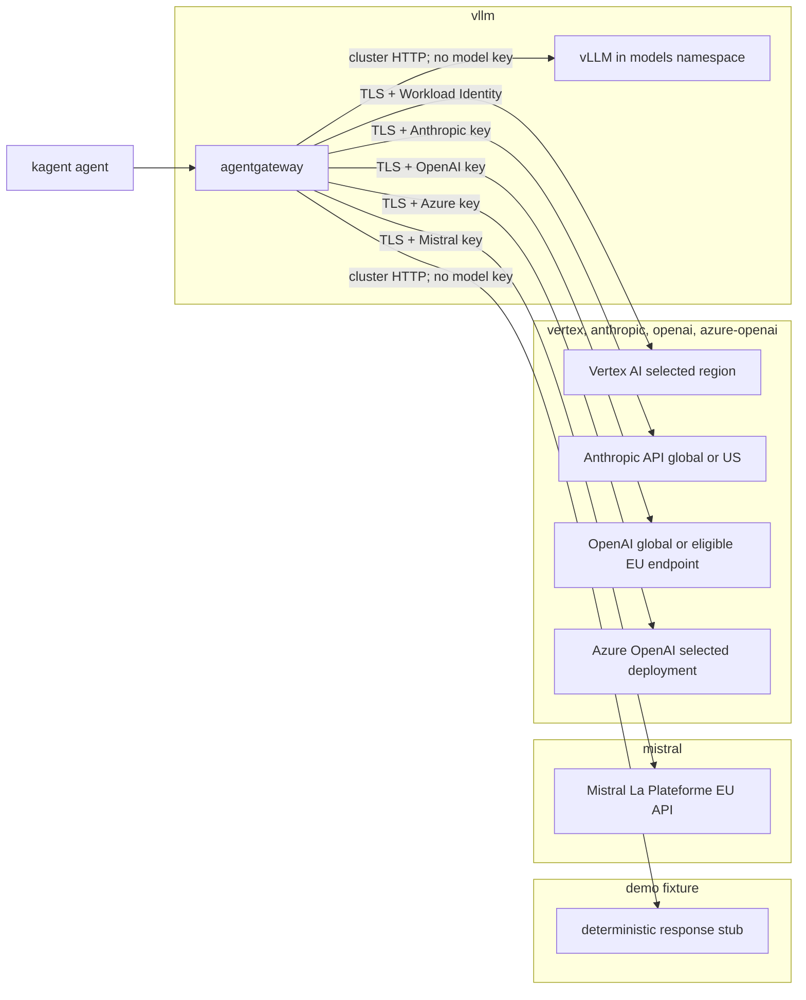

# Model Provider Profiles (D16)

Fgentic keeps model choice at the cluster boundary: agents call the same in-cluster OpenAI-compatible endpoint, while the selected agentgateway profile owns the model endpoint and any credential. This implements [D16](design-decisions.md#d16--sovereign-model-profiles-decided-2026-07-11-implementation-milestone-m1) without giving model credentials to kagent or the bridge.

## Select a profile

Set `llm_provider` and `llm_model` in `clusters/<env>/platform-settings.yaml`, then run `scripts/gen-secrets.sh <server_name> <env>`. The generator emits only the selected API provider's SOPS Secret; Vertex continues to use Workload Identity on GKE or the cluster-only ADC helper on k3d, and self-hosted vLLM needs no model credential.

| `llm_provider` | Additional setting      | Credential environment variable | Secret name           | Prometheus `gen_ai_system` |
| -------------- | ----------------------- | ------------------------------- | --------------------- | -------------------------- |
| `demo`         | evaluation overlay only | none                            | none                  | `openai`                   |
| `vllm`         | none                    | none                            | none                  | `openai`                   |
| `vertex`       | `vertex_region`         | none                            | `gcp-adc` on k3d only | `gcp.vertex_ai`            |
| `mistral`      | none                    | `MISTRAL_API_KEY`               | `mistral-secret`      | `openai`                   |
| `anthropic`    | none                    | `ANTHROPIC_API_KEY`             | `anthropic-secret`    | `anthropic`                |
| `openai`       | `openai_host`           | `OPENAI_API_KEY`                | `openai-secret`       | `openai`                   |
| `azure-openai` | `azure_openai_resource` | `AZURE_OPENAI_API_KEY`          | `azure-openai-secret` | `azure`                    |

Every API-key Secret is namespace-local to `agentgateway-system` and stores the raw key under the literal data key `Authorization`. This is the [agentgateway v1.3.1 Secret resolver contract](https://github.com/agentgateway/agentgateway/blob/v1.3.1/controller/pkg/utils/kubeutils/secrets.go#L116-L125); the gateway inserts the required upstream header. Do not add `Bearer` in the SOPS input.

`demo` is a deterministic OpenAI-compatible response stub used only by `clusters/demo` and `mise run demo:up`. It proves protocol wiring without a model account, prompt egress, or token charge; it cannot reason and is not a D16 production model profile. The `local` and `gcp` overlays cannot select it accidentally through their tracked defaults.

## Data-flow map by profile

Every agent uses the same in-cluster route. The selected profile changes only the final model hop; credentials terminate at agentgateway and never enter kagent or the bridge.



The diagram shows one mutually exclusive deployment choice, not simultaneous fan-out. API-provider account settings still control retention, contractual residency, and deployment geography.

| Profile        | Cost characteristic                                                                                      | Latency expectation                                                                                         |
| -------------- | -------------------------------------------------------------------------------------------------------- | ----------------------------------------------------------------------------------------------------------- |
| `demo`         | No provider or per-token bill; a tiny disposable-cluster workload.                                       | Deterministic fixture latency only; not representative of model inference.                                  |
| `vllm`         | Fixed cluster CPU/GPU and storage cost even when idle; no per-token provider bill.                       | Slow on the reference CPU model; GPU serving is normally faster but materially more expensive.              |
| `mistral`      | Usage-metered API; exact currency cost depends on the selected model and current account contract.       | Internet round trip to the EU service plus model generation; usually faster than the reference CPU vLLM.    |
| `vertex`       | Usage-metered API plus any GCP network/observability charges; account billing is the source of truth.    | Region-dependent internet/cloud hop; the tracked Gemini profile is the currently verified quality baseline. |
| `anthropic`    | Usage-metered API; prompt caching and model choice can materially change token charges.                  | Global or US inference path plus model generation; no EU-only direct route is claimed.                      |
| `openai`       | Usage-metered API; regional eligibility, storage controls, and model tier affect the commercial posture. | Global or eligible EU endpoint round trip; service tier and model dominate tail latency.                    |
| `azure-openai` | Azure consumption under the chosen deployment/SKU; Global, Data Zone, and Regional capacity differ.      | Selected Azure deployment and capacity determine geography, queueing, and tail latency.                     |

Fgentic records provider/model token dimensions but intentionally ships no mutable web-price catalog. Compare currency cost through the provider invoice or a versioned organization-owned catalog; never infer an audited cost by multiplying tokens by an unversioned price.

## Default profile decision (2026-07-14)

The tracked overlays deliberately have two defaults because protocol evaluation and a production-shaped model boundary have different prerequisites:

| Overlay          | Purpose                             | Tracked provider and model           | Credential boundary                                                                                              |
| ---------------- | ----------------------------------- | ------------------------------------ | ---------------------------------------------------------------------------------------------------------------- |
| `clusters/demo`  | Out-of-the-box protocol evaluation  | `demo` / `fgentic-demo`              | None; deterministic in-cluster fixture                                                                           |
| `clusters/local` | Production-shaped local development | `vertex` / `google/gemini-2.5-flash` | Cluster-only `gcp-adc` Secret consumed only by agentgateway                                                      |
| `clusters/gcp`   | Production-shaped GKE reference     | `vertex` / `google/gemini-2.5-flash` | Workload Identity design; required Vertex role tracked in [#400](https://github.com/fmind-ai/fgentic/issues/400) |

Vertex is the pragmatic default for the production-shaped references because it is the verified quality path and can use the maintainer's existing GCP credits. It is **not sovereign-by-default**: complete requests and responses cross the cluster boundary to Google, usage is billed to the selected project, and the project region, account contract, retention settings, and provider-side processing remain operator controls. The credential stays at agentgateway; no Agent, bridge, or Matrix service receives it.

Keep `demo` for credential-free integration evaluation. Select `vllm` when serving-time prompts and responses must stay in the cluster, accepting its download, RAM, latency, and model-quality trade-offs. Mistral and the other API profiles remain explicit operator choices rather than hidden quickstart defaults.

## Data flow and residency

Selecting an API profile sends the complete model request and response from agentgateway to that provider over verified TLS. A profile controls the network endpoint; it cannot prove account-level contracts, retention settings, deployment types, or where provider-side tools send data. Confirm those controls with the provider before sending regulated content.

### Self-hosted vLLM

Set `llm_provider: vllm` and `llm_model: Qwen/Qwen2.5-0.5B-Instruct`. The selected provider inventory deploys the official [vLLM Production Stack chart 0.1.11](https://github.com/vllm-project/production-stack/releases/tag/vllm-stack-0.1.11), the multi-architecture CPU runtime `v0.24.0`, and the public Qwen model at immutable revision `7ae557604adf67be50417f59c2c2f167def9a775`. The chart, runtime, and model are Apache-2.0.

A one-shot loader writes the approximately 1 GB model snapshot to a 3 GiB PVC. Only that prompt-free Job may reach public HTTPS; the serving Pod mounts the cache read-only, enables Hugging Face and vLLM offline/telemetry-off modes, and receives no egress allowance. Agentgateway's vLLM-profile policy additionally limits its proxy to cluster DNS, its XDS control plane, vLLM, and kagent. The loader's public TCP 443 rule is necessarily address-based because portable Kubernetes NetworkPolicy cannot allow an HTTPS FQDN and its CDN aliases.

The reference is deliberately small: 2 CPU/4 GiB requested, 4 CPU/6 GiB limited, 1 GiB KV cache, 4K context, and one concurrent sequence. `Qwen2.5-0.5B-Instruct` makes local sovereignty demonstrable, not production model quality: expect slow CPU generation and materially weaker answers than the API defaults. A useful 7B/8B model needs roughly 14–16 GB for BF16 weights plus runtime/KV memory and normally a 24 GB GPU; an always-on cloud GPU would exceed the project's USD 85/month ceiling, so the GCP reference stays on Vertex.

#### GPU production override

Keep the tracked CPU profile unchanged. A GPU deployment is an environment-owned Flux patch against the selected `agentgateway-provider`, not a second default. The following statically rendered example targets one NVIDIA L4-class GPU with 24 GiB VRAM and `Qwen/Qwen2.5-7B-Instruct` at immutable revision `a09a35458c702b33eeacc393d103063234e8bc28`.

Patch the existing `spec.values.servingEngineSpec.modelSpec[0]` fields individually; do not replace the whole item and lose its service account, hardened contexts, offline environment, or read-only mounts:

```yaml
name: qwen2-5-7b
repository: vllm/vllm-openai
tag: v0.24.0@sha256:251eba5cc7c12fed0b75da22a9240e582b1c9e39f6fbc064f86781b963bd814f
modelURL: /models/qwen2.5-7b-instruct
runtimeClassName: ""
resources:
  requests:
    cpu: "2"
    memory: 8Gi
    nvidia.com/gpu: "1"
  limits:
    cpu: "4"
    memory: 12Gi
    nvidia.com/gpu: "1"
shmSize: 4Gi
vllmConfig:
  enablePrefixCaching: false
  enableChunkedPrefill: false
  maxModelLen: 4096
  dtype: bfloat16
  tensorParallelSize: 1
  maxNumSeqs: 4
  gpuMemoryUtilization: 0.90
  extraArgs:
    - --served-model-name
    - ${llm_model}
    - --no-enable-log-requests
extraVolumes:
  - name: model-cache
    persistentVolumeClaim:
      claimName: qwen2-5-7b-model
  - name: runtime-tmp
    emptyDir:
      sizeLimit: 2Gi
```

The paired cache and routing changes are mandatory:

1. Resize and rename the PVC to `qwen2-5-7b-model` with `25Gi`; the StorageClass must let the CPU loader detach and the GPU node attach it.
1. Keep the pinned CPU loader image and its no-token boundary, but download `Qwen/Qwen2.5-7B-Instruct` at revision `a09a35458c702b33eeacc393d103063234e8bc28` into `/models/qwen2.5-7b-instruct`. Set its deadline to `5400`, request `100m` CPU/`256Mi`, limit it to 1 CPU/1 GiB, and write the same revision to `.ready` only after `snapshot_download` returns.
1. Point the engine init-container marker and model mount at the new path and claim. Use the pinned GPU image above for the init container, allow it up to 3,600 seconds to observe `.ready`, and keep both model mounts read-only.
1. Set `llm_model` to `Qwen/Qwen2.5-7B-Instruct`, change the backend host to `vllm-qwen2-5-7b-engine-service.models.svc.cluster.local`, and update the NetworkPolicy probe's expected Service name.
1. Raise the HelmRelease timeout from `30m` to `90m` and the `agentgateway-provider` Flux timeout from `45m` to at least `90m`; a first 15+ GiB model download must not look like a failed rollout.

The GPU runtime remains operator-owned. An `nvidia.com/gpu` request is the portable scheduling constraint; leave `runtimeClassName` empty when NVIDIA is the node default, or set `nvidia` only after `kubectl get runtimeclass nvidia` succeeds. Accelerator labels such as `cloud.google.com/gke-accelerator: nvidia-l4`, taints/tolerations, driver and device-plugin installation, quantization, context/concurrency limits, node autoscaling, quota, and spend depend on the target cluster. Verify that the pinned multi-platform image resolves for the node architecture before rollout; use an architecture-specific digest if the runtime cannot select from its manifest list.

Materialize the fully merged Helm values—not only the fragment above—at `.agents/tmp/vllm-gpu-values.yaml`, then validate the exact pinned chart render:

```bash
export llm_model=Qwen/Qwen2.5-7B-Instruct

mise exec -- flux envsubst --strict < .agents/tmp/vllm-gpu-values.yaml \
  | mise exec -- helm template vllm vllm-stack \
      --repo https://vllm-project.github.io/production-stack \
      --version 0.1.11 \
      --namespace models \
      --values - \
  | tee .agents/tmp/vllm-gpu-render.yaml \
  | mise exec -- kubeconform -strict -summary

mise exec -- yq -e '
  select(.kind == "Deployment") |
  .spec.template.spec.containers[0].image ==
    "vllm/vllm-openai:v0.24.0@sha256:251eba5cc7c12fed0b75da22a9240e582b1c9e39f6fbc064f86781b963bd814f" and
  .spec.template.spec.containers[0].resources.requests."nvidia.com/gpu" == "1" and
  .spec.template.spec.containers[0].resources.limits."nvidia.com/gpu" == "1" and
  (.spec.template.spec.containers[0].command |
    contains(["/models/qwen2.5-7b-instruct", "--gpu_memory_utilization", "0.9"]))
' .agents/tmp/vllm-gpu-render.yaml
```

This proves rendering, schema validity, and the intended image/resource/command contract only. Live CUDA discovery, model loading, `/health`, direct and agentgateway chat, mention-to-reply, metrics, and NetworkPolicy denial evidence require a funded GPU environment and remain human acceptance work for issue #10.

The current constrained k3d host is not runtime acceptance evidence: it lacks safe memory headroom, and repo-owned k3d servers disable kube-router because this host aborts policy synchronization with `iptables-restore: Message too large`. Do not download the large artifacts merely for static validation or claim “prompts never leave” until the full NetworkPolicy conformance probe and mention-to-reply capture pass on a verified policy engine.

### Mistral La Plateforme

The Kubernetes `AgentgatewayBackend` CRD in v1.3.1 has no native `mistral` field. The profile therefore uses agentgateway's documented [OpenAI-compatible Mistral configuration](https://agentgateway.dev/docs/kubernetes/latest/llm/providers/openai-compatible/) at `api.mistral.ai:443/v1/chat/completions`, with explicit TLS because a host override disables the provider's connector defaults. Mistral states that data is [hosted in the EU by default](https://help.mistral.ai/en/articles/347629-where-do-you-store-my-data-or-my-organization-s-data), while also documenting possible temporary transfers through subprocessors; Enterprise controls and the applicable DPA remain account-level requirements.

The adapter reports `gen_ai_system="openai"`, not `mistral`. Token accounting remains correct, but a `mistral` model-cost catalog cannot be selected correctly through the v1.3.1 Kubernetes CRD. The standalone configuration has a Mistral provider identity, but the Kubernetes API does not expose its `providerOverride`; adding Mistral prices under `openai` would be misleading and is deliberately not done.

### Anthropic

The native `anthropic` provider sends requests to `api.anthropic.com`. Agentgateway converts incoming chat completions to Messages API format, changes the generated Bearer credential to `x-api-key`, and adds `anthropic-version: 2023-06-01`; the Secret still uses `Authorization`.

Anthropic's current [data-residency controls](https://platform.claude.com/docs/en/manage-claude/data-residency) offer `global` or US-only inference, and workspace storage is currently US-only. There is no EU-only direct Anthropic API option to claim in this profile. The default global route may process in Europe or other supported regions; use a region-bound partner platform instead when an EU processing guarantee is required.

### OpenAI

The profile uses `openai_host=api.openai.com` by default. Eligible projects configured for European data residency can set `openai_host=eu.api.openai.com`; OpenAI requires the regional hostname and documents eligibility, endpoint coverage, and modified-abuse-monitoring or zero-data-retention requirements in its [platform data controls](https://platform.openai.com/docs/models/default-usage-policies-by-endpoint). Changing only the hostname does not enroll a project in regional processing.

### Azure OpenAI

Set `azure_openai_resource` to the resource name only, not a URL. The native `azure` provider with `resourceType: OpenAI` derives `<resource>.openai.azure.com` and the stable `/openai/v1/chat/completions` path. The profile uses API-key authentication through Azure's required `api-key` header; Microsoft Entra authentication is a separate credential mode.

The hostname does not encode or enforce residency. Microsoft documents that [Global deployments may process globally, Data Zone deployments stay within the selected US or EU zone, and Standard/Regional deployments process in the deployment region](https://learn.microsoft.com/en-us/azure/foundry/foundry-models/concepts/models-sold-directly-by-azure-region-availability). Use an EU Data Zone or EU regional deployment and avoid a Global deployment when EU processing is required.

## Token metering and acceptance

All profiles preserve the provider-agnostic budget signal:

```promql
sum by (gen_ai_system, gen_ai_request_model, gen_ai_token_type) (
  increase(agentgateway_gen_ai_client_token_usage_sum[5m])
)
```

The v1.3.1 histogram records `input`, `output`, and—when the provider reports them—cache token types. The stable labels are `gen_ai_token_type`, `gen_ai_operation_name`, `gen_ai_system`, and `gen_ai_request_model`; response and route labels appear only when available. `LLMTokenBurnHigh` sums the histogram's `_sum`, so Mistral's and vLLM's OpenAI-adapter labels do not weaken the spend guard.

Static rendering and schema validation prove only that a profile is structurally valid. Closing an API-provider acceptance criterion additionally requires a real, low-token request through the local cluster and an end-to-end Matrix mention, followed by the PromQL check above. vLLM additionally requires `/health`, `/v1/models`, direct and agentgateway chat checks; a failed external request from both serving and proxy Pods; a blocked request from an unrelated namespace; a successful Prometheus scrape; and the generic ingress/egress NetworkPolicy conformance probe. Never treat an `Accepted=True` backend, a synthetic Secret, or a deny manifest on a broken policy engine as runtime proof.

## Model-profile quality evaluation

From the repository root, one approved live run is:

```bash
A2A_API_KEY="$(your-secret-source)" \
  mise run eval:models -- --profile vertex --model google/gemini-2.5-flash
```

The task runs 10 fixed A2A scenarios for each of `platform-helper`, `docs-qa`, and `scribe`. Exact, case-insensitive contains, and regular-expression rubrics are scored locally. Three qualitative scenarios are labeled `optional_llm_judge` and remain visibly unscored; the harness never calls a judge model. It writes `.agents/tmp/model-eval/report.json` with prompts, answers, A2A latency, score, provider/model/route identity, LLM-call count, and token deltas, plus `.agents/tmp/model-eval/comparison.md` with one row per evaluated profile. Re-running the same profile/model replaces that row; a different profile merges only when the scenario digest and any pricing-catalog identity remain comparable.

The harness reads the agentgateway v1.3.1 Prometheus exposition directly. Source inspection pins `agentgateway_gen_ai_client_token_usage` as a histogram with `gen_ai_system`, request/response model, route, and token-type labels. It fails when metrics move in either quiet window, multiple provider/model/route identities change, token series reset, or input/output request counts disagree. Aggregate metrics cannot distinguish unrelated traffic on the exact same series _inside_ one scenario window, so the cluster must otherwise be idle. Agentgateway exposes cost-catalog lookup state but no Prometheus currency value.

Currency is therefore optional and never sourced from mutable web prices. Supply a reviewed JSON catalog with schema `fgentic.eval.pricing.v1`, a non-empty version, an ISO date, a three-letter currency, and exact provider/model rates per million tokens:

```json
{
  "schema_version": "fgentic.eval.pricing.v1",
  "version": "finance-reviewed-2026-07",
  "effective_date": "2026-07-01",
  "currency": "EUR",
  "rates": [
    {
      "system": "gcp.vertex_ai",
      "model": "your-versioned-response-model",
      "per_million_tokens": {
        "input": 0,
        "output": 0
      }
    }
  ]
}
```

Pass it with `--pricing-catalog <path>`. Replace the zero placeholders only with rates reviewed for the named effective date and contract; the provider invoice remains authoritative. To publish a comparison, review the generated JSON and Markdown, then manually copy the approved table into this document with its run date, suite digest, model identities, and catalog version. The harness deliberately never rewrites `docs/models.md`.

## Failover semantics in agentgateway v1.3.1

As of 2026-07-11, Fgentic deliberately ships no transparent primary-to-fallback profile. Priority groups and passive health eviction can move a _later_ request away from an unavailable backend, but the first failed request still surfaces to the caller. Enabling an HTTP retry replays the OpenAI-compatible `POST`; a local two-backend probe observed the primary receive the same request twice. That is unsafe for model calls that may produce non-deterministic output or trigger tools.

[agentgateway issue #1419](https://github.com/agentgateway/agentgateway/issues/1419) tracks the missing distinction between failures known to occur before a request is sent and failures whose execution state is ambiguous. Until that distinction or end-to-end idempotency exists, keep retries disabled: a visible failure is safer than a duplicated consequential action.
