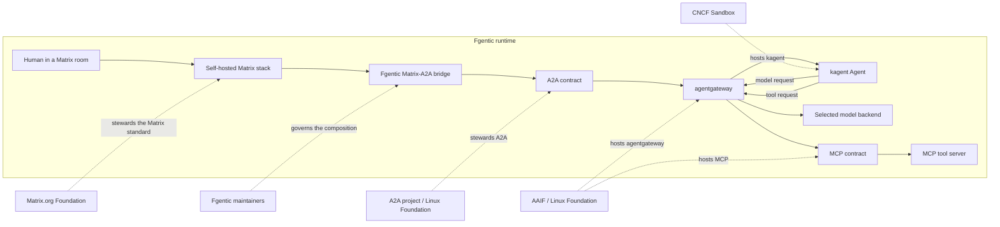

# Open Agentic Stack

Fgentic is an independent [Apache-2.0](../LICENSE) composition of open protocols and open-source implementations. No single foundation governs the complete runtime, and no upstream project's foundation status transfers to Fgentic. This map records the boundaries verified on 2026-07-14; "hosted" means that a named upstream project has a foundation home, not that the foundation operates, certifies, or endorses this deployment.

## Runtime and governance map

Solid arrows are runtime calls. Dotted arrows identify the upstream steward for the named standard or implementation.

The Matrix Foundation arrow applies to the protocol boundary. Synapse, Matrix Authentication Service, and Element clients are implementation products whose governance is distinct from stewardship of the Matrix standard. Likewise, Fgentic's maintainers own the bridge, version pins, manifests, policies, and acceptance evidence even where an upstream foundation hosts a component.

## Stewardship by boundary

| Boundary             | Upstream stewardship                                                                                                                                                                                                                                                                                    | What Fgentic uses                                                                                                              | Claim limit                                                                                                                                    |
| -------------------- | ------------------------------------------------------------------------------------------------------------------------------------------------------------------------------------------------------------------------------------------------------------------------------------------------------- | ------------------------------------------------------------------------------------------------------------------------------ | ---------------------------------------------------------------------------------------------------------------------------------------------- |
| Matrix collaboration | The [Matrix.org Foundation](https://matrix.org/foundation/about/) is the neutral guardian of the standard; its Spec Core Team governs the specification's contents and direction.                                                                                                                       | Standard client-server, federation, and application-service APIs with a self-hosted Synapse, MAS, and Element reference stack. | Foundation stewardship covers the Matrix standard, not the governance or fitness of every implementation and not Fgentic.                      |
| A2A delegation       | The [A2A project](https://github.com/a2aproject/A2A) is a standalone Linux Foundation project governed by its own [Technical Steering Committee](https://github.com/a2aproject/A2A/blob/main/GOVERNANCE.md). It is not an AAIF-hosted project in the current [AAIF catalog](https://aaif.io/projects/). | A2A v1.0 and the official Go SDK form the bridge-to-agent and cross-organization delegation contract.                          | A shared protocol does not make two agents compatible without matching versions, transports, extensions, identity, and authorization policies. |
| MCP tool access      | [Model Context Protocol](https://aaif.io/projects/model-context-protocol/) is an AAIF-hosted project under the Linux Foundation.                                                                                                                                                                        | MCP connects one managed kagent runtime to a reviewed tool server through agentgateway.                                        | Protocol support does not grant network reachability or tool authority; Fgentic's current MCP route is internal and credential-scoped.         |
| Agentic data plane   | [agentgateway](https://aaif.io/projects/agentgateway/) became an AAIF-hosted project on [2026-06-04](https://aaif.io/blog/agentgateway-joins-aaif-as-an-open-gateway-for-agentic-ai-infrastructure/).                                                                                                   | The pinned gateway routes and governs A2A, MCP, and model traffic.                                                             | AAIF does not define or operate Fgentic's credentials, CEL policies, routes, token budgets, or audit retention.                                |
| Agent runtime        | [kagent](https://www.cncf.io/projects/kagent/) was accepted to CNCF on 2025-05-22 at the **Sandbox** maturity level.                                                                                                                                                                                    | The reference Agents run on kagent and expose A2A endpoints.                                                                   | CNCF Sandbox is the entry point for early-stage projects, not Incubation, a production-readiness certificate, or a security guarantee.         |
| Fgentic composition  | Fgentic is governed by its own [maintainer-led model](../GOVERNANCE.md) and current [maintainer list](../MAINTAINERS.md). It is not a hosted project of AAIF, CNCF, the Matrix.org Foundation, or any other foundation.                                                                                 | The bridge, GitOps composition, security policy, tests, and operational runbooks join the layers into one platform.            | A future foundation home is an adoption target, not current membership, endorsement, or a promised outcome.                                    |

## What neutral governance changes

A neutral project home can improve:

- public, multi-party paths for technical decisions and succession;
- shared custody of project assets, trademarks, and contribution policy;
- a durable venue for cross-vendor protocol evolution;
- portability pressure, because independently implemented boundaries must remain explicit.

Those are useful conditions, not outcome guarantees. Foundation hosting alone does **not** guarantee interoperability, maturity, security, maintainer diversity, funding, an SLA, compatibility with Fgentic, or project longevity. It also does not make the whole deployment permissively licensed; the component-by-component obligations remain in [Licensing & Foundation Strategy](licensing.md).

Runtime evidence stays authoritative. The bridge integration gate proves that kagent can be replaced at the A2A boundary by completing a real Matrix application-service round trip against a standalone `a2a-go` server with no kagent resources installed. Other replacements remain possible architectural seams, not certified drop-ins, until their exact versions pass equivalent positive and negative acceptance tests.

## Goose integration decision

**Decision (2026-07-14; reviewed 2026-07-24): do not present a Goose prototype yet.** Goose is an AAIF-hosted project, but shared foundation membership is not a runtime boundary.

1. The latest stable release reviewed was [Goose v1.44.0](https://github.com/aaif-goose/goose/releases/tag/v1.44.0), published 2026-07-23. Its exact tagged [architecture source](https://github.com/aaif-goose/goose/blob/v1.44.0/documentation/docs/goose-architecture/goose-architecture.md#L21-L42) documents MCP extension/client behavior and ACP server/provider surfaces. That review found no supported A2A client or server transport; this is an evidence-based absence inference, not an upstream compatibility promise.
1. Fgentic's current `/mcp` route is a cluster-internal `ClusterIP` surface. It accepts only a SOPS-managed credential bound to `platform-helper` and exposes five allowlisted, read-only Kubernetes tools; it is not a public user-agent integration API ([Security §7.4](security.md#74-governed-mcp-tool-egress)).
1. The readily available demo—connecting Goose directly to an MCP server—would bypass the Matrix-to-A2A delegation path and Fgentic's scoped MCP identity contract. It would prove Goose/MCP compatibility, not a Fgentic capability. Adding an adapter or publishing a credential solely to manufacture that demo would widen the security surface without user value.

Reconsider only when at least one concrete boundary exists:

1. A stable Goose release, or a maintained adapter, implements A2A v1.0 and passes Fgentic's AgentCard, delegation, attribution, timeout, and negative authorization contract. Goose can then demonstrate agent-runtime replacement behind the bridge.
1. Fgentic deliberately ships an external MCP client boundary with an explicit endpoint, workload or user identity, least-privilege catalog, rate limits, audit contract, and revocation path. Goose can then test that boundary as a real external client; [#131](https://github.com/fmind-ai/fgentic/issues/131) is a possible trigger only if its design intentionally exposes such a boundary.
1. An approved in-cluster Goose workload has a product use case that requires the governed MCP route and its acceptance test proves allowed calls, denied calls, and content-free audit attribution—not merely a successful tool invocation. The personal-sandbox design sequence ([#147](https://github.com/fmind-ai/fgentic/issues/147), [#148](https://github.com/fmind-ai/fgentic/issues/148)) is a possible trigger only if it deliberately places Goose behind a governed A2A or MCP contract.

A Goose version bump, AAIF co-membership, or a direct ungoverned MCP call is not by itself a reconsideration trigger.

## Reusable positioning

Use these statements in talks and launch material without collapsing the governance boundaries:

1. **Fgentic is an independently governed composition of independently stewarded layers:** Matrix for collaboration, A2A for delegation, MCP for tools, agentgateway for the data plane, and kagent as the reference runtime.
1. **AAIF hosts MCP, agentgateway, and Goose; A2A is a separate Linux Foundation project; kagent is CNCF Sandbox; the Matrix.org Foundation stewards the Matrix standard.**
1. **Foundation homes improve the conditions for shared stewardship, not the runtime evidence.** Fgentic remains independently governed, and every security, compatibility, and production claim must be proved by the deployed version and configuration.
