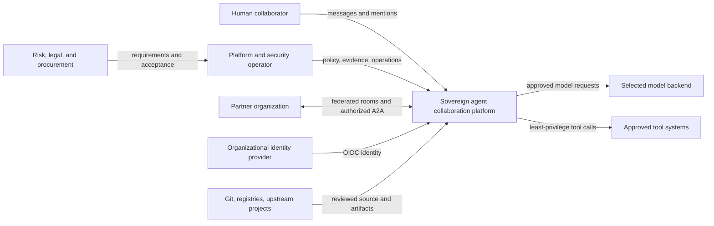
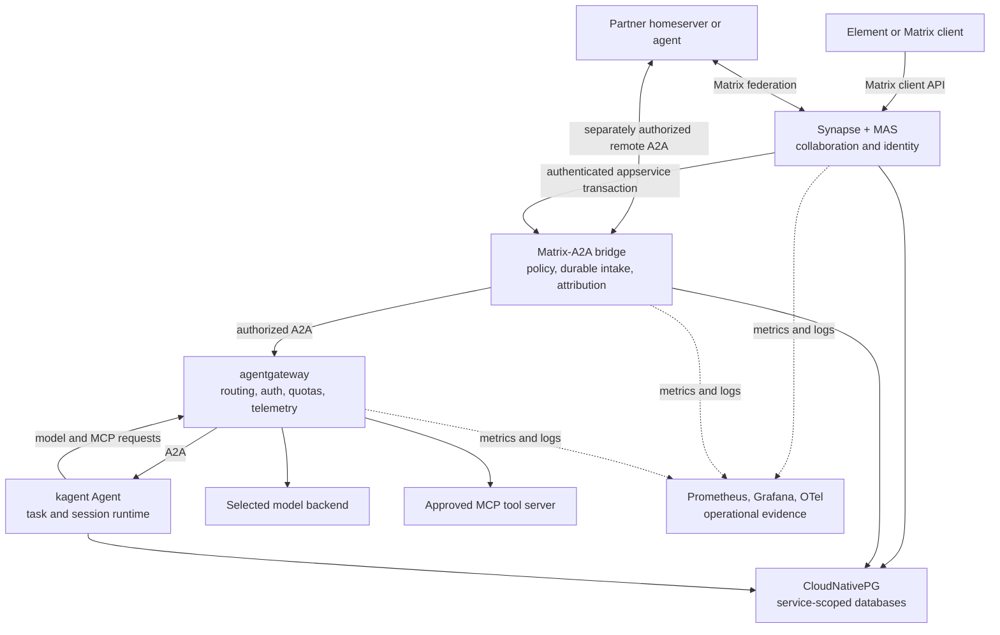

# Sovereign agent platform reference architecture

## 1. Purpose and decision rule

This document helps an architecture or procurement team specify an agent-collaboration platform without making one vendor's product vocabulary a requirement. Each requirement stands alone. The Fgentic column is an evidence-backed mapping to one reference implementation, not a claim that Fgentic is the only way to comply.

Treat every response as one of four evidence classes:

- **Implemented:** source and deterministic tests prove the stated behavior at a bounded interface.
- **Configured:** deployment manifests declare the control, but the target environment must prove enforcement.
- **External:** an operator, provider, contract, or live deployment owns the evidence.
- **Deferred:** the reference implementation does not currently provide the capability.

A repository check is not production evidence. A successful model answer is not authorization evidence. A reservation is not measured consumption. Procurement should reject any response that silently promotes one of those claims into another.

## 2. Requirements matrix

### 2.1 Identity and attribution

| ID   | Vendor-neutral requirement                                                                                                                                             | Evidence to request                                                                                                                                    | Fgentic reference mapping                                                                                                                                                                                    |
| ---- | ---------------------------------------------------------------------------------------------------------------------------------------------------------------------- | ------------------------------------------------------------------------------------------------------------------------------------------------------ | ------------------------------------------------------------------------------------------------------------------------------------------------------------------------------------------------------------ |
| IA-1 | The platform shall integrate with the organization's identity provider through a documented standard and preserve stable, revocable subject identifiers.               | Login and revocation tests; issuer, audience, subject, claim-mapping, session, and emergency-access configuration; lifecycle owner.                    | **Configured:** Matrix Authentication Service fronts an upstream OpenID Connect provider; Keycloak is the replaceable reference. Target login, logout, revocation, and break-glass acceptance are external.  |
| IA-2 | Every agent invocation shall retain the authenticated collaboration identity, conversation scope, selected agent, task identity, outcome, and reply relationship.      | One content-bounded evidence bundle joining an authenticated user event to the agent request, task transition, and resulting collaboration event.      | **Implemented:** the bridge joins the full Matrix MXID, room/event, ghost, A2A context/task, terminal outcome, and reply. `X-User-Id` remains asserted attribution, not delegated end-user authentication.   |
| IA-3 | Human, workload, agent, partner, and provider identities shall be distinct, least-privileged, independently revocable, and prohibited from implicit privilege sharing. | Credential and role inventory; positive and negative authorization tests; rotation evidence; proof that model or tool credentials do not reach agents. | **Implemented / Configured:** separate Matrix, bridge, gateway, MCP, partner, database, and model-provider identities are declared. Real rotation and target-cluster NetworkPolicy enforcement are external. |

### 2.2 Governance and cost

| ID   | Vendor-neutral requirement                                                                                                                                           | Evidence to request                                                                                                                                                   | Fgentic reference mapping                                                                                                                                                                                                          |
| ---- | -------------------------------------------------------------------------------------------------------------------------------------------------------------------- | --------------------------------------------------------------------------------------------------------------------------------------------------------------------- | ---------------------------------------------------------------------------------------------------------------------------------------------------------------------------------------------------------------------------------- |
| GC-1 | Admission, routing, tool authority, data classification, and consequential-action policy shall be deterministic controls outside the model.                          | Policy source, change approval, deny tests, rollback procedure, and proof that prompt text cannot grant authority.                                                    | **Implemented:** explicit agent mappings, sender policy, admission policy, gateway authorization, MCP catalog entries, and NetworkPolicy bound the model-facing path. No universal action-level approval is claimed.               |
| GC-2 | The platform shall bound invocation pressure and expose consumption without conflating rate limits, reservations, token telemetry, invoices, or currency budgets.    | Queue and rate configuration; overload tests; model-usage telemetry; billing reconciliation; alert ownership; documented label/cardinality and attribution limits.    | **Implemented / External:** bounded queues, sender/room rate limits, aggregate token metrics, and per-partner admission reservations exist. Per-human token attribution, provider billing caps, and currency budgets are external. |
| GC-3 | Every deployable artifact and configuration change shall have an immutable identity, review history, vulnerability process, provenance boundary, and rollback route. | Signed artifact and SBOM verification; dependency inventory; vulnerability response route; Git history; deployment reconciliation and rollback evidence.              | **Configured:** the bridge image and chart are built, scanned, signed, attested, and digest-pinned; Flux reconciles reviewed Git. Target signature rejection and upstream component provenance remain separate acceptance items.   |
| GC-4 | Capacity and resilience claims shall name the measured workload, topology, failure mode, observation window, and unsupported boundary.                               | Dated load report; effective resource requests; saturation signals; failure drills; recovery objectives; evidence that quotas are not presented as measured capacity. | **External:** the repository supplies a bounded bridge regression and an availability posture, not a production capacity certificate. See section 4 before accepting any user, room, delegation, RTO, or HA claim.                 |

### 2.3 Auditability

| ID   | Vendor-neutral requirement                                                                                                                                           | Evidence to request                                                                                                                                      | Fgentic reference mapping                                                                                                                                                                                                 |
| ---- | -------------------------------------------------------------------------------------------------------------------------------------------------------------------- | -------------------------------------------------------------------------------------------------------------------------------------------------------- | ------------------------------------------------------------------------------------------------------------------------------------------------------------------------------------------------------------------------- |
| AU-1 | Audit records shall distinguish authenticated facts, asserted attribution, policy decisions, attempted side effects, ambiguous delivery, completion, and projection. | Field-level schema; one successful and one denied trace; replay and uncertain-delivery cases; explanation of every join and inference limit.             | **Implemented:** versioned, content-free bridge evidence records stable stages and reasons. Lost A2A acknowledgement becomes `ambiguous`; completion and Matrix reply delivery remain distinct.                           |
| AU-2 | Audit collection shall minimize content, bound identifiers and cardinality, define retention and access, and support integrity-preserving export.                    | Data dictionary; content redaction tests; retention schedule; access logs; export format; integrity control; deletion exceptions and legal-hold process. | **Configured / External:** the bridge schema and collection runbook are bounded, but several upstream logs remain stdout-only and deployment retention is operator-owned. A durable compliance sink is not implied.       |
| AU-3 | Operators shall be able to reproduce the effective version, policy, agent contract, artifact digest, and acceptance evidence for a decision-relevant event.          | Source revision; rendered configuration; agent and model contract identifiers; artifact signatures; test reports; evidence custody and expiry policy.    | **Implemented / Configured:** Git, immutable digests, agent fingerprints, Flux revisions, and the attribution bundle provide the join surfaces. Target-cluster collection and long-term evidence custody remain external. |

### 2.4 Data residency and confidentiality

| ID   | Vendor-neutral requirement                                                                                                                                                    | Evidence to request                                                                                                                                                  | Fgentic reference mapping                                                                                                                                                                                                                |
| ---- | ----------------------------------------------------------------------------------------------------------------------------------------------------------------------------- | -------------------------------------------------------------------------------------------------------------------------------------------------------------------- | ---------------------------------------------------------------------------------------------------------------------------------------------------------------------------------------------------------------------------------------- |
| DR-1 | The buyer shall be able to identify every location where message, prompt, file, embedding, model request, model response, metric, trace, backup, and replicated room data go. | Data-flow diagram by selected deployment profile; regions and subprocessors; egress tests; storage classes; backup location; partner replication and deletion terms. | **Configured / External:** self-hosted and API model profiles have explicit paths, with agentgateway as the model chokepoint. Provider account residency, joined-partner retention, and target storage locations require separate proof. |
| DR-2 | Classification, room membership, model routing, retrieval authorization, and retention shall be explicit, fail closed, and tested at their enforcement boundary.              | Classification policy; room and agent allowlists; negative routing and retrieval tests; retention purge evidence; policy-owner approval.                             | **Implemented / Configured:** agent mappings, room/sender policy, finite Matrix retention, and ACL-bearing grounding schemas are declared. Permission-aware retrieval serving is **Deferred** until its full identity path ships.        |
| DR-3 | Encryption and plaintext exceptions shall be stated per hop and store; keys, administrators, joined organizations, and backups that can read content shall be named.          | Transport/storage encryption inventory; key custody and rotation; E2EE compatibility test; approved plaintext exception and data-classification boundary.            | **Configured:** agent rooms are deliberately plaintext because the appservice is not E2EE-aware. Real-partner rooms require the narrow ADR 0015 controls; an E2EE requirement blocks deployment until the escape hatch exists.           |
| DR-4 | Erasure, retention, backup expiry, and legal-hold behavior shall be defined store by store, including limits where deletion cannot be propagated.                             | Tested subject-erasure runbook; retention jobs; backup lifecycle; federation limitations; exception approvals and completion evidence.                               | **Configured / External:** finite Matrix/media policy and store-by-store boundaries are documented. Real erasure, backup expiry, kagent-session handling, and partner action are deployment or roadmap evidence.                         |

### 2.5 Interoperability

| ID   | Vendor-neutral requirement                                                                                                                                              | Evidence to request                                                                                                                                          | Fgentic reference mapping                                                                                                                                                                                                     |
| ---- | ----------------------------------------------------------------------------------------------------------------------------------------------------------------------- | ------------------------------------------------------------------------------------------------------------------------------------------------------------ | ----------------------------------------------------------------------------------------------------------------------------------------------------------------------------------------------------------------------------- |
| IN-1 | Collaboration, agent delegation, tool access, identity, deployment, and observability interfaces shall use documented, versioned standards with explicit negotiation.   | Exact protocol versions and extensions; conformance results; negative version tests; compatibility policy; no proprietary service required in the path.      | **Implemented:** Matrix, A2A, MCP, OIDC, Kubernetes, Gateway API, PostgreSQL, Git, and OpenTelemetry form the seams. Exact versions and extensions are pinned; shared protocol names alone do not establish compatibility.    |
| IN-2 | Cross-organization collaboration shall authenticate organizations and agent endpoints separately from caller authorization, room admission, and data-sharing approval.  | Federation agreement; server and room admission policy; transport authorization; signed agent identity; route restriction; revocation and offboarding tests. | **Implemented / External:** the provider-free lab proves closed Matrix federation plus Signed AgentCard, JWT, exact-route, and reservation controls. A real partner remains a bilateral technical and contractual acceptance. |
| IN-3 | Replacing a component shall preserve the required interface, security controls, evidence fields, failure semantics, and acceptance tests—not merely basic connectivity. | Replacement contract and data export; positive and negative conformance; rollback; performance and operations evidence; named unsupported behavior.          | **Implemented in one bounded seam:** the bridge integration test replaces kagent with a standalone A2A runtime. Other layers have documented exit targets but are not certified drop-ins.                                     |

### 2.6 Exit strategy

| ID   | Vendor-neutral requirement                                                                                                                                                     | Evidence to request                                                                                                                                      | Fgentic reference mapping                                                                                                                                                                                          |
| ---- | ------------------------------------------------------------------------------------------------------------------------------------------------------------------------------ | -------------------------------------------------------------------------------------------------------------------------------------------------------- | ------------------------------------------------------------------------------------------------------------------------------------------------------------------------------------------------------------------ |
| EX-1 | Configuration, identity mappings, policy, prompts, agent contracts, audit schemas, and deployment inputs shall be exportable in documented, non-proprietary formats.           | Export inventory and samples; schema versions; secret-handling procedure; recreation test in an independent environment.                                 | **Configured:** Git-native YAML/JSON/TOML, Matrix/A2A/MCP contracts, and PostgreSQL boundaries are inspectable. Secrets, live Matrix state, and provider-side identities require controlled exports or recreation. |
| EX-2 | The supplier shall identify one-way doors, migration dependencies, data-loss windows, rollback points, termination assistance, and post-exit deletion evidence before award.   | Executed exit plan; responsibility matrix; cost and duration assumptions; rollback rehearsal; provider and partner deletion attestations.                | **External:** the [exit strategy](exit-strategy.md) and [migration guide](migration-guide.md) define the work, but each adopter must execute and price it against its selected providers and topology.             |
| EX-3 | Licenses, trademarks, governance, maintenance, security response, support, and succession shall be assessed per component rather than inherited from a protocol or foundation. | Software bill of materials; license and notice inventory; support contracts; maintainer/governance review; vulnerability route; abandonment contingency. | **Configured / External:** Fgentic code is Apache-2.0 and component obligations are mapped. ESS Community, other upstream support, legal approval, and service ownership remain explicit procurement decisions.    |

## 3. Architecture views

### 3.1 System context

The system boundary is operator-controlled. External identity, model, tool, partner, and supply-chain services cross separately governed interfaces; self-hosting one layer does not make those external boundaries sovereign by association.

### 3.2 Reference containers and trust boundaries

The container view shows logical responsibilities, not a promise that every box scales independently. Solid arrows carry runtime data; the GitOps path reconciles desired state.

## 4. Availability and measured scale envelope

### 4.1 HA honesty boundary

Element positions [ESS Community](https://element.io/server-suite/community) for non-professional evaluation and small-to-mid-sized deployments of 1–100 users, without performance guarantees or vendor-backed production support. Its [edition comparison](https://github.com/element-hq/ess-helm#editions) places in-cluster HA, dynamic scaling, advanced security services, and professional support in ESS Pro.

That is an upstream packaging and support boundary, not proof that an arbitrary 100-user workload fits and not a new license term. Open-source Synapse can be engineered with workers and external services, but that is a different, adopter-owned topology unless the selected distribution and acceptance plan deliver it.

Fgentic's checked-in GKE reference improves component availability but is not end-to-end HA:

- the default is two `e2-standard-4` nodes in one zone; host separation is not zone or region resilience;
- CloudNativePG declares three instances, while stateless ingress, MAS, gateway, and control-plane workloads are replicated;
- Synapse remains one fast-restart StatefulSet with an RWO media volume;
- the bridge intentionally remains one ready intake replica to preserve ordering, with durable recovery but interrupted intake during replacement;
- no repository fixture establishes a production RTO, RPO, SLO, regional failover, or commercial support commitment.

A production buyer therefore has three explicit choices: procure a supported HA distribution such as ESS Pro; design and own a separately qualified open-source Synapse topology; or accept the reference pilot boundary with named downtime and support risk. The decision belongs in the architecture record and contract, not in an optimistic replica count.

### 4.2 What has actually been measured

The dated [bridge performance evidence](performance.md) is a regression floor for one component path, not a platform capacity ceiling:

| Dimension               | Measured evidence                                                                                             | Safe claim                                                                                      | Missing before production sizing                                                                                   |
| ----------------------- | ------------------------------------------------------------------------------------------------------------- | ----------------------------------------------------------------------------------------------- | ------------------------------------------------------------------------------------------------------------------ |
| Enabled or active users | Not measured. Element's 1–100 figure describes the ESS Community product posture, not this deployment's test. | No user-capacity claim.                                                                         | Identity population, activity distribution, sync/device behavior, media, federation, model, and tool workload.     |
| Concurrent active rooms | 10 rooms in the isolated bridge fixture.                                                                      | Per-room FIFO and cross-room work were exercised at this scope.                                 | Target Synapse, database, model, tool, network, retention, and client workload over the required observation time. |
| Delegations             | 100 mentions total, 10 per room, against a 2-second SDK-backed A2A stub.                                      | Exactly one reply per mention, durable drain, and deduplicated replay passed for the fixture.   | Real agent/model latency distribution, token volume, failures, files, long tasks, and sustained arrival rate.      |
| Bridge concurrency      | 10 observed concurrent delegations under a configured global cap of 16; peak queue depth 79.                  | The bounded dispatcher respected the cap and stayed below its 64 MiB heap gates in the fixture. | Saturation curve, steady-state throughput, database headroom, alert thresholds, and target resource limits.        |
| Scenario duration       | 39.219 seconds for the measured fixture after setup.                                                          | Reproducible regression timing on the recorded environment only.                                | Percentile latency under target load; duration is not an SLO.                                                      |
| Graceful replacement    | A separate fixture proves SIGTERM drain, replacement readiness, and replay deduplication.                     | The graceful path is tested.                                                                    | Node loss, zone loss, hard crash, dependency outage, restore, and observed RTO/RPO on the candidate deployment.    |

Before a pilot becomes a production sizing claim, record at least enabled and daily-active users, joined rooms, concurrent syncing devices, messages and media per second, delegations per minute, token distributions, long-task duration, partner count, retention volume, and each dependency's saturation signal. Re-run normal load, burst, rollout, dependency-failure, and restore scenarios on the exact target topology.

## 5. Copy-ready RFP checklist

The following text can be copied into an RFP. Ask respondents to answer **Comply**, **Partially comply**, **Roadmap**, or **Does not comply**, with an evidence link, evidence date, responsible party, limitation, and additional cost for every line.

### Identity and attribution

- [ ] **IA-1:** The solution shall integrate with our identity provider through a documented standard and shall demonstrate login, logout, revocation, emergency access, and stable subject mapping.
- [ ] **IA-2:** The solution shall join each agent invocation and result to the authenticated collaboration identity, conversation, selected agent, task, policy outcome, and resulting event without presenting asserted headers as end-user authentication.
- [ ] **IA-3:** The solution shall maintain separate, least-privilege, independently revocable identities for humans, workloads, agents, partners, tools, databases, and model providers.

### Governance, cost, and resilience

- [ ] **GC-1:** The solution shall enforce admission, routing, tool authority, data classification, and consequential-action policy deterministically outside the model, with positive, negative, and rollback tests.
- [ ] **GC-2:** The solution shall bound queues and invocation rates and shall distinguish admission reservations, measured token consumption, provider invoices, and currency budgets in every dashboard and report.
- [ ] **GC-3:** The solution shall identify every deployed artifact and configuration immutably and provide review history, vulnerability handling, provenance, SBOM, signature-verification, and rollback evidence.
- [ ] **GC-4:** Every capacity, availability, RTO, and RPO response shall name the measured workload, topology, failure mode, duration, percentile, evidence date, unsupported boundary, and party responsible for meeting it.

### Auditability

- [ ] **AU-1:** Audit evidence shall distinguish authenticated facts, asserted attribution, policy decisions, attempted side effects, ambiguous delivery, agent completion, and delivery to the collaboration plane.
- [ ] **AU-2:** Audit collection shall minimize content, bound cardinality, define retention and access, support integrity-preserving export, and document deletion and legal-hold exceptions.
- [ ] **AU-3:** The solution shall reproduce the effective source revision, rendered policy, agent and model contract, artifact digest, and unexpired acceptance evidence for a decision-relevant event.

### Data residency and confidentiality

- [ ] **DR-1:** The response shall locate every message, prompt, file, embedding, model request and response, metric, trace, backup, and federated room copy, including regions, subprocessors, administrators, and deletion obligations.
- [ ] **DR-2:** Data classification, room membership, model routing, retrieval authorization, and retention shall fail closed and shall be tested at the actual enforcement boundary.
- [ ] **DR-3:** The response shall state encryption and plaintext exceptions per hop and store, identify every party able to read content, and demonstrate key custody, rotation, and any required E2EE behavior.
- [ ] **DR-4:** The solution shall provide tested store-by-store erasure, retention, backup-expiry, federation, and legal-hold procedures, including limits where deletion cannot be propagated.

### Interoperability

- [ ] **IN-1:** Collaboration, agent delegation, tool access, identity, deployment, and observability interfaces shall use documented, versioned standards with explicit extension and compatibility handling.
- [ ] **IN-2:** Cross-organization operation shall separate organization identity, agent identity, caller authorization, room admission, route restriction, data-sharing approval, revocation, and offboarding.
- [ ] **IN-3:** A component-replacement claim shall include data export, conformance, negative security, failure-semantics, performance, operations, rollback, and unsupported-behavior evidence—not only successful connectivity.

### Exit and commercial boundary

- [ ] **EX-1:** Configuration, identity mappings, policy, prompts, agent contracts, audit schemas, and deployment inputs shall be exportable in documented, non-proprietary formats and recreatable independently.
- [ ] **EX-2:** The response shall identify one-way doors, migration dependencies, data-loss windows, rollback points, termination assistance, post-exit deletion evidence, duration, and cost before award.
- [ ] **EX-3:** The response shall list licenses, trademarks, governance, maintainers, security-response routes, support commitments, succession risks, and abandonment contingencies per component.

### Required acceptance records

- [ ] The supplier has provided a dated requirements traceability matrix with no blank or inherited claims.
- [ ] The buyer has approved the selected identity, data, model, tool, partner, support, and exit boundaries.
- [ ] Positive and negative controls passed on the exact release and target topology without skipped or weakened assertions.
- [ ] Load, failure, restore, upgrade, and exit exercises cover the agreed workload and objectives.
- [ ] Residual risks, external dependencies, roadmap items, and evidence-expiry dates have named owners.

## 6. Fgentic acceptance record for this artifact

| Gate                                         | Current state | Completion evidence                                                                                                                         |
| -------------------------------------------- | ------------- | ------------------------------------------------------------------------------------------------------------------------------------------- |
| Vendor-neutral requirement matrix            | Prepared      | Section 2 separates requirements and requested evidence from the Fgentic mapping.                                                           |
| Context and container architecture views     | Prepared      | Section 3 contains editable Mermaid source and surrounding prose.                                                                           |
| Copy-ready procurement checklist             | Prepared      | Section 5 preserves the matrix identifiers and requires evidence, limitations, ownership, dates, and cost.                                  |
| HA honesty boundary                          | Prepared      | Section 4 distinguishes the ESS edition boundary, reference replicas, single Synapse/bridge posture, and unavailable production objectives. |
| Measured bridge envelope                     | Prepared      | Section 4 cites the dated 100-mention/10-room regression without converting it into user or production capacity.                            |
| Target-platform user and production envelope | **Pending**   | Run and retain representative load, failure, and restore evidence on the candidate topology; RED does not own shared runtime acceptance.    |
| External practitioner review                 | **Pending**   | Record reviewer role, organization, date, findings, and incorporated changes in issue #73 before calling the artifact procurement-ready.    |
