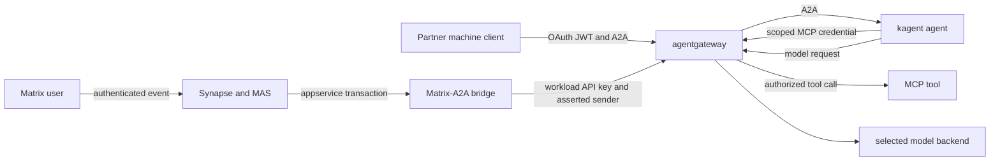

# Security and Auditor Dossier

This dossier gives security reviewers a concise, evidence-bound view of Fgentic. It maps the implemented reference architecture to the [OWASP Top 10 for Agentic Applications 2026](https://genai.owasp.org/resource/owasp-top-10-for-agentic-applications-for-2026/) and the [OWASP Top 10 for LLM Applications 2025](https://genai.owasp.org/llm-top-10/). The mapping was reviewed on 2026-07-16. It is traceability, not certification, and it does not imply that a control eliminates the corresponding risk.

The normative trust boundaries remain in the [security specification](security.md). The [full threat model](security/threat-model.md) owns the assets, actors, STRIDE analysis, control states, and residual risks. This document is the auditor-oriented index into that evidence.

## Assurance legend and product boundary

| State           | Meaning                                                                                                    |
| --------------- | ---------------------------------------------------------------------------------------------------------- |
| **Implemented** | Code or a manifest exists and has a deterministic repository-owned check.                                  |
| **Configured**  | A manifest exists, but enforcement still requires acceptance on the selected cluster and installed CNI.    |
| **External**    | The control belongs to an operator, identity or model provider, federation partner, or contractual gate.   |
| **Deferred**    | The design exists, but the complete enforcing path is not shipped and must not support a production claim. |

Fgentic owns the Matrix-to-A2A bridge, its configuration schema and Helm chart, the GitOps composition, and the repository checks. Matrix, Synapse, MAS, Keycloak, agentgateway, kagent, model backends, CloudNativePG, and Traefik are independently maintained components that Fgentic configures and validates. A repository render proves configuration intent. Only a target-cluster probe proves that the selected versions, admission controller, identity provider, CNI, and storage layer enforce that intent.

## Trust-boundary summary

Natural-language content is untrusted at every hop. Authentication establishes the caller at a protocol boundary; it does not make the caller's text, retrieved documents, tool results, or another agent's output trustworthy. Model output never grants authority.

## Concrete control inventory

| Control                                     | State           | OWASP coverage                                 | Enforcing artifacts and deterministic evidence                                                                                                                                                                                                                                                                                                                                                                                                  | Limit that remains                                                                                                                                                                      |
| ------------------------------------------- | --------------- | ---------------------------------------------- | ----------------------------------------------------------------------------------------------------------------------------------------------------------------------------------------------------------------------------------------------------------------------------------------------------------------------------------------------------------------------------------------------------------------------------------------------- | --------------------------------------------------------------------------------------------------------------------------------------------------------------------------------------- |
| Matrix sender and target admission          | **Implemented** | ASI01, ASI03, ASI07, ASI10; LLM01, LLM06       | [`handler.go`](../apps/matrix-a2a-bridge/internal/bridge/handler.go) admits only explicit local ghost targets; [`agents.go`](../apps/matrix-a2a-bridge/internal/bridge/agents.go) applies full-MXID sender and homeserver policy. Bridge tests exercise local, federated, and external-appservice identities.                                                                                                                                   | A homeserver authenticates its own accounts. A federated server controls every identity in its namespace.                                                                               |
| Untrusted-content provenance and loop break | **Implemented** | ASI01, ASI08, ASI09; LLM01, LLM05              | [`handler.go`](../apps/matrix-a2a-bridge/internal/bridge/handler.go) creates the bridge-owned provenance envelope, labels room text as untrusted, ignores `m.notice`, and emits replies as `m.notice` plus `m.automated`. Wire and handler tests cover the envelope and loop guard.                                                                                                                                                             | Delimiters and system prompts influence model behavior but are not security boundaries. A human can copy automation output into a new request.                                          |
| A2A workload authentication                 | **Implemented** | ASI03, ASI07, ASI10; LLM06                     | [`a2a-authorization.yaml`](../infra/agentgateway/admission/a2a-authorization.yaml) requires the bridge's workload identity and exact kagent methods and paths. [`test-a2a-authorization.sh`](../scripts/test-a2a-authorization.sh) checks 401, 403, and allowed behavior against the pinned gateway. [D11](design-decisions.md) records why kagent remains an unauthenticated boundary.                                                         | The bridge uses one rotatable workload key. `X-User-Id` is downstream attribution, not authentication.                                                                                  |
| Network isolation of unauthenticated kagent | **Configured**  | ASI02, ASI03, ASI05, ASI07; LLM02, LLM06       | [`infra/agentgateway/base/networkpolicy.yaml`](../infra/agentgateway/base/networkpolicy.yaml) and [`infra/kagent/networkpolicy.yaml`](../infra/kagent/networkpolicy.yaml) restrict direct paths. [`test-network-policies-kind.sh`](../scripts/test-network-policies-kind.sh) provides isolated Calico conformance evidence.                                                                                                                     | Enforcement depends on the installed CNI. The target cluster must repeat deny and allow probes; kagent itself remains unauthenticated in its current mode.                              |
| Least-privilege MCP tools                   | **Implemented** | ASI01, ASI02, ASI03, ASI04, ASI05; LLM01–LLM06 | [`mcp-authorization.yaml`](../infra/agentgateway/base/mcp-authorization.yaml) authenticates platform-helper and admits five read-only Kubernetes tools. The immutable surface pin and reviewed source/license entry live in [`infra/mcp-catalog`](../infra/mcp-catalog/). [`test-mcp-governance.sh`](../scripts/test-mcp-governance.sh) checks identity, route, tool filtering, catalog coverage, surface drift, and content-free audit fields. | An allowed read operation can still disclose data within its RBAC scope. The credential is not a human identity, per-call approval, mTLS identity, or non-exportable workload identity. |
| Bounded invocation and model spend          | **Implemented** | ASI02, ASI08; LLM06, LLM10                     | Bridge token buckets cap sender/agent and room invocation rates in [`handler.go`](../apps/matrix-a2a-bridge/internal/bridge/handler.go); bounded durable queues reject excess work before model execution. [`docs/observability.md`](observability.md) defines aggregate model-token alerts. The federation profile adds per-`azp` reservations in [`rate-limit.yaml`](../infra/federation/delegation/rate-limit.yaml).                         | Reservations are admission accounting, not measured consumption or a provider billing cap. Operator budgets remain external.                                                            |
| Agent reference admission                   | **Implemented** | ASI02–ASI06, ASI10; LLM02–LLM06                | [`agent-references.yaml`](../infra/policies/agent-references.yaml) admits reviewed model, identity, and MCP references. [`test-admission-policies.sh`](../scripts/test-admission-policies.sh) includes positive and negative policy cases.                                                                                                                                                                                                      | ValidatingAdmissionPolicy protects admitted Kubernetes objects, not runtime model intent or external systems.                                                                           |
| Runtime and service posture admission       | **Implemented** | ASI03–ASI05, ASI10; LLM02, LLM03, LLM06        | [`image-references.yaml`](../infra/policies/image-references.yaml) rejects `:latest`; [`namespace-pss.yaml`](../infra/policies/namespace-pss.yaml) retains managed-namespace PSS labels; [`service-exposure.yaml`](../infra/policies/service-exposure.yaml) restricts Service exposure. Static and API-server policy gates live in [`test-admission-policies.sh`](../scripts/test-admission-policies.sh).                                       | Several upstream workloads support only the documented baseline posture. Admission does not make a vulnerable image safe.                                                               |
| Software supply-chain provenance            | **Configured**  | ASI04, ASI05, ASI10; LLM03                     | [CD](../.github/workflows/cd.yml) builds, scans, signs, attests, and digest-pins bridge artifacts. [`check-supply-chain.sh`](../scripts/check-supply-chain.sh) verifies the workflow and Flux identity contract; [D13](design-decisions.md) and the [verification runbook](security/supply-chain.md) define the signed-artifact posture.                                                                                                        | Target acceptance still requires the bootstrap interlock to be active and an unsigned chart to be rejected. Upstream components retain their own supply chains.                         |
| Agent-room confidentiality policy           | **Implemented** | ASI09; LLM02                                   | [`infra/matrix/helmrelease.yaml`](../infra/matrix/helmrelease.yaml) force-disables default room encryption for the crypto-free appservice path. [ADR 0008](adr/0008-unencrypted-agent-rooms.md) owns the same-organization decision; [ADR 0015](adr/0015-federated-room-encryption.md) constrains real-partner plaintext rooms and defines the E2EE escape hatch.                                                                               | Joined participants, homeservers, administrators, clients, and backups can receive plaintext. Sensitive data is prohibited unless the documented classification and contract permit it. |
| Federation identity and route restriction   | **Implemented** | ASI01, ASI03, ASI07–ASI10; LLM01, LLM02, LLM06 | [Federation §8](federation.md) and the [profile](../infra/federation/) combine closed homeserver allowlists, room-v12 and server-ACL policy, an exact public docs-qa route, ES256/JCS Signed AgentCard verification, strict JWT issuer/audience/`azp`, and per-client reservation limits. [`seed-federation.sh`](../scripts/seed-federation.sh) is the provider-free acceptance proof.                                                          | An admitted partner controls its identities and retains replicated plaintext room history. A Signed AgentCard authenticates the advertised agent, not its caller.                       |
| Attribution without identity inflation      | **Implemented** | ASI03, ASI07, ASI09; LLM02, LLM06              | The bridge audit record joins Matrix event, full MXID, room, ghost, A2A context/task, outcome, and reply evidence. [`audit-attribution.sh`](../scripts/audit-attribution.sh) fails closed on ambiguous joins; the [audit runbook](audit.md) states the proof limits.                                                                                                                                                                            | Agentgateway model metrics are aggregate. Concurrent model requests cannot be uniquely assigned to a user from gateway timing. `azp` identifies a machine client, not a human.          |
| Grounding ACL and embedding schema          | **Implemented** | ASI03, ASI06; LLM02, LLM04, LLM08              | [`knowledge-schema-v1.yaml`](../infra/postgres/knowledge-schema-v1.yaml) constrains classification, provenance, principals, partner groups, dimensions, and authorization-first exact ranking. [`test-knowledge-store.sh`](../scripts/test-knowledge-store.sh) provides static schema and query-plan checks plus an isolated runtime mode.                                                                                                      | The retrieval-serving identity projection is not shipped. Authorized ingestion can misclassify content, and embeddings must be protected like their source data.                        |
| Secrets and scoped database roles           | **Implemented** | ASI03, ASI04; LLM02, LLM03, LLM07              | Production secrets are SOPS-age ciphertext; examples define the inventory without live material. Namespace-local copies and per-service database roles are checked by repository gates. The [operations handbook](operations-handbook.md) owns rotation and recovery procedure.                                                                                                                                                                 | Cluster and GitOps administrators are trusted operators. Real rotation, recovery, and access review are operator evidence.                                                              |

## OWASP Agentic Top 10 2026 mapping

| Risk                                           | Fgentic controls and evidence                                                                                                                                                                                  | Coverage and residual risk                                                                                                                                                                 |
| ---------------------------------------------- | -------------------------------------------------------------------------------------------------------------------------------------------------------------------------------------------------------------- | ------------------------------------------------------------------------------------------------------------------------------------------------------------------------------------------ |
| **ASI01 Agent Goal Hijack**                    | The bridge marks Matrix content as untrusted; sender policy, rate limits, tool authorization, and admission remain deterministic outside the model. See [`prompt-injection.md`](security/prompt-injection.md). | **Partial containment.** Prompt injection and goal manipulation remain unsolved model-behavior risks. The provenance envelope is not a cryptographically isolated instruction channel.     |
| **ASI02 Tool Misuse and Exploitation**         | Per-agent MCP authentication, a five-tool gateway allowlist, read-only tool mode, namespaced RBAC, reviewed surface pins, content-free tool audit, and NetworkPolicy limit capability.                         | **Partial containment.** A model can misuse an allowed read operation. There is no universal human approval gate for every tool call.                                                      |
| **ASI03 Identity and Privilege Abuse**         | Full MXID policy, bridge workload authentication, separate MCP credentials, scoped database roles, and partner JWT `azp` checks prevent implicit privilege inheritance.                                        | `X-User-Id` remains asserted attribution. A partner `azp` is a machine identity, and ordinary agents do not carry permission-aware end-user credentials to tools.                          |
| **ASI04 Agentic Supply Chain Vulnerabilities** | Immutable image references, reviewed MCP source/license/catalog entries, complete MCP surface pins, bridge image/chart signatures, provenance, SBOMs, and Flux verification constrain substitution.            | The signed-chart bootstrap requires live acceptance. Fgentic composes upstream components and cannot attest their build systems as its own.                                                |
| **ASI05 Unexpected Code Execution (RCE)**      | Tool exposure excludes shell and write operations; workload security contexts, PSS-label admission, service-exposure policy, immutable images, and egress policy reduce execution paths.                       | Fgentic provides no general-purpose agent sandbox or proof that upstream software is free of RCE defects.                                                                                  |
| **ASI06 Memory and Context Poisoning**         | Context IDs are isolated per room and ghost, agent replies do not auto-delegate, and no generic room-history retrieval path is exposed. The grounding schema encodes provenance and ACL invariants.            | Ordinary agent contexts are persistent and can retain adversarial content. The permission-aware retrieval Agent and fresh-context projection are **Deferred** until their full path ships. |
| **ASI07 Insecure Inter-Agent Communication**   | Only mapped local ghosts or explicitly pinned remote agents resolve. Remote A2A requires a verified Signed AgentCard; local A2A requires the bridge workload key; replies are non-actionable notices.          | Signed cards authenticate targets, not callers. Partner authorization and transport policy remain separate, and arbitrary multi-agent delegation is not exposed.                           |
| **ASI08 Cascading Failures**                   | Non-actionable replies, bounded queues, sender/room rate limits, request/task deadlines, conservative ambiguous-delivery handling, and federation reservations bound amplification.                            | These controls limit mechanical amplification; they do not prove semantic correctness or stop a human from propagating a bad result.                                                       |
| **ASI09 Human-Agent Trust Exploitation**       | Agent ghosts are explicit identities; replies are `m.notice`/`m.automated`; audit documentation separates attribution, authentication, reservation, and consumption.                                           | Humans can still over-trust plausible output. Fgentic does not certify truthfulness or replace review for consequential decisions.                                                         |
| **ASI10 Rogue Agents**                         | Explicit agent mappings, admission-approved references, per-agent capability policy, immutable configuration, Signed AgentCards for remote targets, and audit outcomes constrain enrollment and reach.         | Controls govern identity and capability, not model alignment. There is no behavioral attestation that can prove an admitted model will remain aligned.                                     |

## OWASP LLM Top 10 2025 mapping

| Risk                                       | Fgentic controls and evidence                                                                                                                                                                  | Coverage and residual risk                                                                                                                                                               |
| ------------------------------------------ | ---------------------------------------------------------------------------------------------------------------------------------------------------------------------------------------------- | ---------------------------------------------------------------------------------------------------------------------------------------------------------------------------------------- |
| **LLM01 Prompt Injection**                 | Untrusted-content provenance, explicit system-prompt guidance, sender admission, least-privilege tools, and policy outside the model limit impact.                                             | **Unsolved.** No delimiter, classifier, prompt, model, fine-tune, or RAG design reliably prevents direct or indirect injection.                                                          |
| **LLM02 Sensitive Information Disclosure** | Model credentials stay in agentgateway; service credentials and databases are scoped; error and audit paths are content-free; model profiles and room classifications declare data boundaries. | Selected model providers and joined room participants receive content by design. An allowed read tool or compromised workload can disclose data within its reachable scope.              |
| **LLM03 Supply Chain**                     | Digest pins, vulnerability scanning, SBOMs, provenance attestations, signatures, MCP catalog review, surface pins, and Flux verification make reviewed artifacts traceable.                    | Live signature enforcement and upstream component provenance require separate evidence. A scan is time-bounded and does not prove absence of vulnerabilities.                            |
| **LLM04 Data and Model Poisoning**         | Immutable model/profile inventory, reviewed MCP metadata, deterministic fixtures, grounding provenance fields, and explicit ingestion/ACL review requirements constrain sources.               | A generic trusted ingestion service and poisoning detector are not shipped. An authorized ingester or upstream model publisher can still introduce poisoned data.                        |
| **LLM05 Improper Output Handling**         | Agent output is `m.notice` plus `m.automated`; the bridge never delegates it automatically. Errors are bounded and internal endpoints are not posted into rooms.                               | A human or another system can manually treat output as instructions. Consumers must validate model output before using it in code, queries, URLs, or consequential actions.              |
| **LLM06 Excessive Agency**                 | Explicit agents, scoped MCP tools, read-only RBAC, API-key and CEL authorization, NetworkPolicy, rate limits, and no default public kagent route implement least agency.                       | No universal action-level human approval exists, and allowed capabilities can still be misused.                                                                                          |
| **LLM07 System Prompt Leakage**            | Secrets are not stored in prompts; credentials live in scoped Secrets and stay out of provenance, errors, metrics, and audit fields.                                                           | System prompts are not secrets and may be disclosed or inferred. Confidential values must never depend on prompt secrecy.                                                                |
| **LLM08 Vector and Embedding Weaknesses**  | The grounding schema requires classification, provenance, ACL operands, fixed dimensions, and an authorization-first exact-ranking path; schema and plan checks reject drift.                  | The retrieval-serving path is not yet complete. Embeddings are derived sensitive data, authorized ingestion can misclassify rows, and vector similarity cannot enforce access control.   |
| **LLM09 Misinformation**                   | Deterministic evaluation fixtures and explicit evidence/residual-risk documentation detect regressions in expected behavior and discourage authority inflation.                                | Fgentic does not guarantee factual accuracy. Model output requires source-aware human review where correctness matters; deterministic fixtures are not a general truthfulness benchmark. |
| **LLM10 Unbounded Consumption**            | Per-sender/per-room limits, bounded durable queues, deadlines, aggregate token metrics and alerts, provider-free test profiles, and per-partner reservations constrain usage.                  | Reservations are not consumption, aggregate metrics are not per-human billing, and provider billing caps and incident response remain operator controls.                                 |

## High-risk boundaries auditors should test

### Prompt injection is containment, not prevention

The bridge-generated provenance envelope helps the model distinguish the authenticated Matrix event fields from room text, but both ultimately enter natural-language context. A sender can imitate delimiters, a retrieved document can carry indirect instructions, and an allowed tool result can contain adversarial text. Refusal by a model is not acceptance evidence. Consequential action must be rejected or approved by deterministic policy outside the model; Fgentic does not claim that prompt sanitization closes ASI01 or LLM01.

### Attribution is not downstream authentication

Synapse attributes an event to the authenticated Matrix session that submitted it. The bridge passes that full MXID as `X-User-Id`, and kagent stores it in an unauthenticated mode. The bridge workload API key and NetworkPolicy protect that assertion path, but the header is not an OIDC token or delegated end-user credential. Likewise, the federation JWT `azp` identifies an authorized machine client, and a Signed AgentCard authenticates the advertised remote agent. None of these identifies a natural person beyond its documented boundary.

### Admission and supply-chain controls have distinct jobs

Admission policies reject known-invalid Kubernetes configuration before persistence: unapproved agent references, mutable `:latest` tags, lost namespace PSS labels, and unsafe Service types. They do not verify image signatures, inspect model intent, or remediate vulnerable dependencies. The CD and Flux chain separately produces and verifies bridge artifact identity, while vulnerability scans provide dated findings. Target acceptance must exercise both layers and retain the resulting evidence.

### Federation admits an organization, not a trustworthy human

Closed federation, room-v12 policy, server ACLs, the callback border, exact public A2A routing, Signed AgentCards, JWT authorization, and reservations reduce the exposed surface. They cannot make an admitted partner benign, retract plaintext history already replicated to that partner, or bind a partner-controlled MXID to a legal identity. Real federation therefore also requires bilateral classification, retention, incident, offboarding, and contractual controls described in the [onboarding](federation-onboarding.md) and [offboarding](federation-offboarding.md) runbooks.

## Auditor verification sequence

1. Review the selected cluster overlay and classify each relevant threat-model control as Implemented, Configured, External, or Deferred.
1. Run `mise run check` and `mise run test` on the exact source revision without suppressions.
1. Verify the effective render, admission-policy negative cases, A2A authorization, MCP identity/tool filtering, catalog and surface pins, and supply-chain policy.
1. On the target cluster, prove every required NetworkPolicy deny and allow path with the installed CNI. Do not substitute a manifest render for this step.
1. Collect one content-free attribution bundle with `mise exec -- scripts/audit-attribution.sh` and require every deterministic Matrix, bridge, context, and task join to match.
1. For federation, run the provider-free lab acceptance and verify card tampering, JWT identity/audience failures, route restriction, quota exhaustion, room admission, server ACLs, and callback denial.
1. Verify the deployed bridge image and chart signature, provenance, SBOM, digest, and exact workflow identity; exercise rejection of an unsigned chart once the bootstrap interlock is active.
1. Record the selected model provider's retention terms, data location, contractual controls, budget cap, and incident owner. These are external evidence.
1. Record every Deferred, Configured, and External residual risk accepted for production, including prompt injection, plaintext-room participants, administrator trust, upstream vulnerabilities, disaster recovery, and provider behavior.

The [threat-model acceptance list](security/threat-model.md#tm7-acceptance-and-review) remains the complete gate. Revisit this dossier whenever a public listener, agent capability, identity projection, model or tool provider, retrieval path, federation partner, admission invariant, or artifact-verification step changes.
