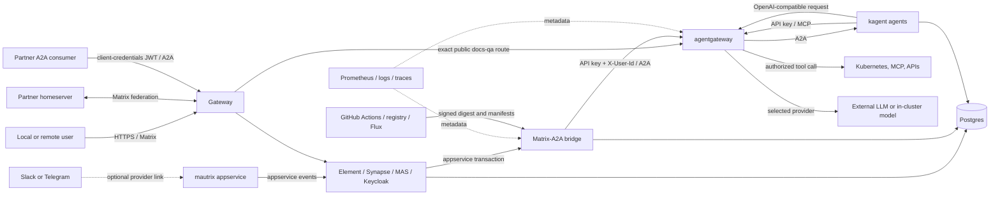

# Fgentic Threat Model

This document applies STRIDE to the Fgentic reference architecture. It is an evidence map, not a claim that every planned control is deployed. Each control below is marked with one of four states:

- **Implemented:** code or a manifest exists and has a deterministic local check.
- **Configured:** the manifest exists, but the control still needs runtime acceptance on the target cluster.
- **Deferred:** the design exists only in a milestone, issue, or proposed ADR.
- **External:** the control belongs to an operator, identity provider, model provider, or partner.

## TM1. Scope and assets

The model covers the public Gateway, Element/Synapse/MAS/Keycloak identity path, Matrix rooms, the Matrix-to-A2A bridge, partner-to-agent A2A delegation, agentgateway, kagent and its agents/tools, model providers (including the in-cluster vLLM and deterministic evaluation profiles), Postgres, observability, Flux, and the build/deployment pipeline.

| Asset                                           | Security property that matters                                                                                                                           |
| ----------------------------------------------- | -------------------------------------------------------------------------------------------------------------------------------------------------------- |
| Matrix identities and sessions                  | An event is attributed to the authenticated MXID accepted by its homeserver; account control is not inferred beyond that.                                |
| Room state, history, and membership             | Only authorized members receive future room state; retention, redaction, federation replication, and client caches remain explicit limits.               |
| Delegation authority                            | A Matrix sender or partner machine client can invoke only an explicitly published agent under deterministic identity and admission policy.               |
| Agent/tool authority                            | An agent holds only the read or write capability needed for its declared purpose; model text never grants authority.                                     |
| Prompts, replies, artifacts, and session memory | Content crosses only the documented Matrix, A2A, tool, and selected model-provider boundaries.                                                           |
| Runtime credentials                             | Model, appservice, A2A, OAuth, signing, and scoped MCP keys remain out of plaintext git, narrowly scoped at runtime, rotatable, and absent from logs.    |
| Postgres state and backups                      | Integrity, availability, role separation, and bounded retention are preserved.                                                                           |
| Audit evidence                                  | Sender, target, time, outcome, token reservations, and actual model usage can be joined only to the documented extent; reservations are not consumption. |
| Software supply chain                           | Source, image digest, signature, provenance, chart, and deployed workload remain traceable without trusting mutable tags.                                |
| LLM budget and cluster capacity                 | A sender, room, agent, or compromised workload cannot cause unbounded model spend or resource exhaustion.                                                |

Availability of a single-node local evaluation cluster is not a production SLO. Confidentiality against a cluster administrator, endpoint owner, selected external model provider, or joined federation partner is also out of scope: those actors necessarily operate a plaintext boundary.

## TM2. Actors and assumptions

| Actor                        | Assumed capability                                                                                                                                                                                                |
| ---------------------------- | ----------------------------------------------------------------------------------------------------------------------------------------------------------------------------------------------------------------- |
| Local user                   | Holds a valid Matrix session and can submit arbitrary room content, mentions, edits, reactions, and attachments where room power levels allow.                                                                    |
| Federated user or homeserver | Controls all identities on its own server, can send adversarial signed events, and retains every event replicated into its rooms.                                                                                 |
| Partner A2A consumer         | Holds or steals a machine credential, can submit arbitrary A2A documents within its published routes, and can exhaust its own quota; a client ID does not identify a human.                                       |
| Bridged-network sender       | Controls a Slack, Teams, Telegram, or other remote identity whose mapping semantics are defined by that bridge, not by Matrix or the local IdP.                                                                   |
| Internet attacker            | Can scan public Gateway listeners, send malformed protocol traffic, steal reusable credentials, and attempt denial of service.                                                                                    |
| Malicious room content       | Can contain prompt injection, delimiter imitation, tool instructions, URLs, encoded data, and model-generated follow-up content.                                                                                  |
| Compromised workload         | Can use its mounted secrets, ServiceAccount, network reachability, and namespace permissions; NetworkPolicy and gateway authorization are assumed to limit lateral movement only when runtime conformance passes. |
| Model or tool provider       | Receives every request intentionally routed to it and may retain, inspect, transform, or reject data according to its contract.                                                                                   |
| Cluster or GitOps operator   | Can read Kubernetes state and logs, reconcile manifests, and alter workloads; administrative compromise is detected and recovered operationally, not prevented by this architecture.                              |
| Build-system attacker        | Attempts dependency, workflow, runner, registry, or artifact substitution before Flux deployment.                                                                                                                 |

Trust is transitive only where this document says so. In particular, an MXID is not an OIDC token, `X-User-Id` is not kagent authentication, a Signed AgentCard is not caller authorization, a JWT `azp` is not a natural person, model output is not authorization, and a valid partner event proves the sending homeserver rather than a natural person.

## TM3. Trust boundaries

The arrows are data boundaries, not endorsements. Dashed paths are optional or deferred. The following identifiers are used in the STRIDE table:

| Boundary                                      | Data crossing it                                                                                         |
| --------------------------------------------- | -------------------------------------------------------------------------------------------------------- |
| B1 Internet → Gateway                         | TLS requests for Matrix client, federation, public A2A, OIDC, Element, and Keycloak endpoints.           |
| B2 IdP/MAS → Matrix account                   | OIDC authorization result, immutable localpart claim, display name, and email.                           |
| B3 Synapse → appservice bridge                | Matrix events, sender/room identifiers, appservice tokens, and transaction IDs.                          |
| B4 Room content → agent                       | Bridge provenance envelope plus untrusted Matrix content and conversation context.                       |
| B5 Bridge → agentgateway → kagent             | Bridge API-key credential, asserted `X-User-Id`, AgentCard, A2A messages, tasks, and replies.            |
| B6 Agent → agentgateway → tools               | Per-agent MCP credential, tool method/name/arguments, tool results, and side effects.                    |
| B7 Agent → selected model                     | Prompt/session content, model name, tokens, and model response.                                          |
| B8 Workloads → Postgres/backups               | Matrix, identity, bridge, and agent state under separate database roles.                                 |
| B9 Workloads → observability                  | Metrics, content-free audit fields, request metadata, logs, and future traces.                           |
| B10 Source/build/registry → Flux              | Source revision, workflow identity, image/chart artifacts, attestations, signatures, and digests.        |
| B11 Partner or external network → local rooms | Remote signed Matrix events or bridge-mapped third-party identities and content.                         |
| B12 Partner A2A consumer → gateway → kagent   | Public Signed AgentCard, OAuth access token, A2A message/task data, token-budget reservation, and reply. |

## TM4. STRIDE analysis

| Boundary                                    | STRIDE threats                                                                                                                                                                                                                                                                                                                      | Controls and evidence                                                                                                                                                                                                                                                                                                                                                                                                                                                                                                                                                                                                                                                                                                                                  | Residual risk / required action                                                                                                                                                                                                                                                                                                                                                                                                                                                                                                                                                                                                                                              |
| ------------------------------------------- | ----------------------------------------------------------------------------------------------------------------------------------------------------------------------------------------------------------------------------------------------------------------------------------------------------------------------------------- | ------------------------------------------------------------------------------------------------------------------------------------------------------------------------------------------------------------------------------------------------------------------------------------------------------------------------------------------------------------------------------------------------------------------------------------------------------------------------------------------------------------------------------------------------------------------------------------------------------------------------------------------------------------------------------------------------------------------------------------------------------ | ---------------------------------------------------------------------------------------------------------------------------------------------------------------------------------------------------------------------------------------------------------------------------------------------------------------------------------------------------------------------------------------------------------------------------------------------------------------------------------------------------------------------------------------------------------------------------------------------------------------------------------------------------------------------------- |
| B1 Internet → Gateway                       | **S:** stolen sessions or DNS/TLS impersonation. **T:** malformed protocol/state input. **R:** incomplete edge logs. **I:** public metadata or endpoint leakage. **D:** floods and expensive login requests. **E:** exposed admin endpoints.                                                                                        | **Configured:** TLS listeners and certificate references in `infra/gateway/gateway.yaml`; route ownership through Gateway API. **Implemented:** Keycloak disables registration and enables brute-force protection; the GCP profile disables MAS password login; the federation profile assigns Matrix and A2A routes to explicit namespace-owned listeners.                                                                                                                                                                                                                                                                                                                                                                                            | Target-cluster TLS, DNS, generic edge-flood, and recovery acceptance is still required. The federation lab proves its Matrix admission boundary and exact A2A route, but one disposable cluster is not production perimeter evidence.                                                                                                                                                                                                                                                                                                                                                                                                                                        |
| B2 IdP/MAS → Matrix account                 | **S/E:** mutable or attacker-chosen claim takes over an MXID. **T:** client-secret or callback substitution. **R:** ambiguous provisioning. **I:** excess identity claims. **D:** IdP outage blocks login.                                                                                                                          | **Implemented:** required administrator-managed `matrix_localpart`, `on_conflict: fail`, fixed provider ULID/callback, confidential client, and first-login import in `infra/keycloak/realm-config.yaml`, `infra/matrix/helmrelease.yaml`, and `docs/identity.md`. Bootstrap and provider material share one bootstrap-only encrypted source.                                                                                                                                                                                                                                                                                                                                                                                                          | Keycloak startup import does not rotate an existing realm. Live client/user rotation and Entra/generic-provider validation are operator procedures. Account recovery and compromised IdP administrators remain **External**.                                                                                                                                                                                                                                                                                                                                                                                                                                                 |
| B3 Synapse → bridge                         | **S:** forged sender or appservice caller. **T:** duplicate/altered transaction. **R:** content-free audit record missing. **I:** token or room-content logs. **D:** transaction or delegation backlog. **E:** appservice namespace abuse.                                                                                          | **Implemented:** matching appservice registration secrets; exclusive bot/ghost regexes; event dedup in Postgres; per-room FIFO dispatch with a 16-worker cap plus accepted running-and-queued caps of 32 per room and 256 globally (D3-D5); silent pre-admission overload rejection with a terminal content-free audit; intake-first shutdown with a processor barrier, bounded delegation grace, and terminal audits for rejected/dropped targets; ingress policy limited to Matrix and monitoring namespaces; offline appservice-token rotation and mixed-version rejection rehearsal.                                                                                                                                                               | The appservice transaction is acknowledged before asynchronous queue admission, so a `queue_full` target is intentionally rejected rather than retried or replied to; operators must alert on that bounded outcome. Shutdown can still cancel accepted work after the 25-second grace, but every not-yet-started target receives a content-free `shutdown` audit. The constrained shared k3d policy engine cannot provide valid enforcement evidence, and the isolated Calico fixture does not yet exercise the bridge ingress policy. Installed-cluster bridge policy acceptance remains required. A stolen appservice token remains high impact.                           |
| B4 Room content → agent                     | **S:** user text imitates bridge provenance. **T/E:** prompt injection redirects tools or policy. **R:** model cannot prove instruction origin. **I:** induced exfiltration. **D:** recursive/bulk prompts.                                                                                                                         | **Implemented:** bridge-generated provenance envelope, separate untrusted-content delimiter, local ghost resolution, sender policies (D6), rate limits (D7), `m.notice` loop break (D8), and generic room errors. `docs/security/prompt-injection.md` defines least-privilege and approval requirements.                                                                                                                                                                                                                                                                                                                                                                                                                                               | Delimiters and prompts are not security boundaries. Consequential tools need deterministic authorization outside the model. Sample-agent least privilege and adversarial tests are tracked in #24 and #41.                                                                                                                                                                                                                                                                                                                                                                                                                                                                   |
| B5 Bridge → gateway → kagent                | **S/E:** arbitrary pod spoofs `X-User-Id` or invokes an agent. **T:** path/header rewriting. **R:** identity lost between hops. **I:** AgentCard or error detail leaks. **D:** slow tasks exhaust workers.                                                                                                                          | **Implemented:** bridge derives `X-User-Id` from the event, authenticates with a separate random API key, and agentgateway applies strict API-key authentication plus fail-closed CEL workload authorization to the whole A2A route, including AgentCards. The exact pinned gateway passes 401/403/200 probes. Long tasks are bounded and polled (D9); contract tests pin the A2A wire (D10); exact kagent/agentgateway policies pass isolated kind+Calico deny/allow and deletion-mutation conformance.                                                                                                                                                                                                                                               | kagent 0.9.11 still has `unsecure` authentication and a no-op authorizer (D11); the bridge key authorizes the mapped kagent route as one workload, not individual humans or agents. Installed-cluster CNI and reconciled-path acceptance remain required. [ADR 0010](../adr/0010-defer-spiffe-workload-identity.md) defers SPIRE with explicit end-to-end adoption triggers.                                                                                                                                                                                                                                                                                                 |
| B6 Agent → agentgateway → tools             | **S:** stolen per-agent key or tool endpoint impersonation. **T/E:** model selects unsafe command or arguments, or poisoned server metadata redirects model behavior. **R:** side effect lacks approval/audit. **I:** tool reads or exports excess data. **D:** loops or broad queries.                                             | **Implemented:** kagent rewrites the managed internal MCP URL to agentgateway; strict API-key authentication binds `apiKey.agent=platform-helper`; fail-closed MCP CEL exposes exactly five tools; the upstream is independently read-only with namespaced get/list/watch RBAC and no Secrets/ClusterRole; its image digest and complete typed MCP surface are pinned. Static provenance checks and scheduled live comparison reject post-review surface drift. Content-free gateway records carry authenticated agent, tool, target, status, and duration. Isolated Calico denies direct managed-agent `:8084` egress and permits the gateway path.                                                                                                   | The static key is exportable and authenticates the Agent workload, not a Matrix human or individual model decision. A compromised platform-helper can reuse its five capabilities. A reviewed pin cannot identify malicious-from-day-one metadata or prove behavior matches descriptions; #132 remains the vetting boundary. The kagent controller retains direct `:8084` discovery, while Agent pods require controller `:8083`, which also multiplexes an unreferenced `/mcp` handler that L4 NetworkPolicy cannot path-filter. Installed-CNI enforcement and one live governed call/audit capture remain required; consequential-action approval is application-specific. |
| B7 Agent → model                            | **S:** provider/endpoint substitution. **T:** prompt/response modification. **R:** weak request correlation. **I:** provider retention, training, logging, or geographic transfer. **D:** token/spend exhaustion. **E:** model output drives tools.                                                                                 | **Implemented:** provider is selected per cluster; credentials exist only at agentgateway; provider-neutral token recording/alert rules; bridge sender/room limits; exact profile policies pass isolated Calico conformance, including denied vLLM serving egress and allowed gateway-to-vLLM traffic. **Configured:** the serving workload uses a revision-pinned offline cache.                                                                                                                                                                                                                                                                                                                                                                      | External providers receive plaintext prompts under their own contracts. Region, retention, abuse monitoring, and invoice limits are **External** and profile-specific. An installed vLLM profile still needs target-CNI and complete request-path acceptance. Currency cost is not evidence-backed without a versioned catalog/correlation.                                                                                                                                                                                                                                                                                                                                  |
| B8 Workloads → Postgres/backups             | **S/E:** one service reuses another role. **T:** state or backup corruption. **R:** administrative changes unlogged. **I:** PVC, WAL, or backup disclosure. **D:** shared-cluster or restore failure.                                                                                                                               | **Configured:** separate roles/databases for Synapse, MAS, bridge, kagent, Keycloak, and enabled external bridges; exact TLS HBA database/role pairs followed by reject rules; CNPG WAL/nightly backup and 30-day catalog retention (D4, D5, D12; ADR 0007); two-phase external-bridge `NOLOGIN` offboarding. Secrets are SOPS-encrypted.                                                                                                                                                                                                                                                                                                                                                                                                              | Shared-cluster failure, local database administration, and operator access remain. Backup confidentiality and restore acceptance depend on the target GCP IAM/bucket deployment; no production restore proof is claimed. Media-store durability remains open in D12.                                                                                                                                                                                                                                                                                                                                                                                                         |
| B9 Workloads → observability                | **S/T:** fabricated or modified evidence. **R:** missing logs or ambiguous joins. **I:** prompts, MXIDs, rooms, tokens, or headers leak. **D:** high-cardinality labels exhaust Prometheus.                                                                                                                                         | **Implemented:** stable `fgentic.delegation.v1` content-free record; bounded outcome vocabulary; task/session join runbook and offline collector tests; aggregate metrics omit personal/high-cardinality IDs. Bridge spans omit content, and the exact Collector → Jaeger → Grafana backend path passes synthetic OTLP acceptance. `docs/audit.md` records retention and correlation limits.                                                                                                                                                                                                                                                                                                                                                           | Pod stdout and the in-memory Jaeger reference are not durable evidence. Agentgateway model requests cannot yet be uniquely joined to a Matrix task; exact per-task currency cost is unavailable. Full cross-component trace continuity and an approved restricted log store remain acceptance work (#35, #37).                                                                                                                                                                                                                                                                                                                                                               |
| B10 Build/registry → Flux                   | **S/T:** malicious dependency, workflow, image, chart, or mutable tag. **R:** build origin unavailable. **I:** workflow secret exposure. **D:** registry/source outage. **E:** compromised CI deploys code.                                                                                                                         | **Implemented:** CI gates; image scan; keyless image/chart signing; Syft SBOM and SLSA/SBOM OCI attestations; immutable image/chart digest transition; exact Flux chart signer policy in `.github/workflows/cd.yml` and `apps/matrix-a2a-bridge/deploy/helmrelease.yaml` (D13). Renovate groups coupled pins.                                                                                                                                                                                                                                                                                                                                                                                                                                          | The source stays in its safe suspended/Git-chart bootstrap state until both GHCR packages are public and the first workflow publishes a signed chart. Runtime `SourceVerified=True`, unsigned-chart rejection, and image admission remain deployment acceptance in #45.                                                                                                                                                                                                                                                                                                                                                                                                      |
| B11 Partner/external network → local room   | **S:** partner homeserver or bridge fabricates its own users. **T:** malicious state/content. **R:** remote attribution stops at the partner organization. **I:** history replicates to partner servers/services. **D:** identity churn, event storms, oversized media, or bridge loops. **E:** remote sender invokes local agents. | **Implemented:** bridge rejects foreign look-alike ghosts; federated senders are deny-by-default unless both server/sender policy allows them (D6); configured appservice namespace prefixes classify bridged senders; those senders require an explicit full-MXID `allowedSenders` match; invocation admission, generated Matrix notices, keyed limiter memory/cleanup, and accepted dispatcher work are independently bounded; content-free audit records carry origin kind/network; bot replies are `m.notice` (D8). The federation lab additionally proves closed homeserver allowlists, room v12, initial server ACLs, and its callback border. **Configured:** optional digest-pinned Slack/Telegram units retain their separate trust boundary. | An admitted homeserver can still forge its own users and retain replicated history. Standard NetworkPolicy admits arbitrary non-private IPv4 TCP/443 because it cannot select provider FQDNs. Slack/Telegram provider login, installed-CNI probes, oversized-media behavior, bidirectional fidelity, offboarding, and account/terms acceptance require live evidence; Teams remains coexistence under review in ADR 0011. No external-network MXID is equivalent to a local IdP identity.                                                                                                                                                                                    |
| B12 Partner A2A consumer → gateway → kagent | **S:** stolen/forged token or agent identity. **T:** tampered card, request, method, path, or token budget. **R:** reservation mistaken for consumption. **I:** public capability metadata or reply disclosure. **D:** quota exhaustion or rate-limit outage. **E:** another Agent or direct kagent endpoint becomes reachable.     | **Implemented:** the federation profile exposes only the exact docs-qa card and invocation routes on dedicated listeners; signs the RFC 8785 JCS payload with ES256 and publishes a verify-only JWK; validates JWT issuer, JWKS signature, `fgentic-a2a` audience, and `azp=org-b-a2a`; requires a bounded integer `maxTokens`; and uses fail-closed Redis-backed reservations keyed by `azp`. NetworkPolicy admits Traefik only to the public proxy listener while kagent stays ClusterIP-only. `mise run fed:up` exercises valid and adversarial credentials, budgets, methods, paths, signature verification, 200/401/403/404/429 outcomes, and a provider-free downstream reply.                                                                   | A confidential-client secret is reusable until rotated, and a stolen access token remains valid for its five-minute lifetime. `azp` identifies a partner client, not a human or workload instance. Reservation can exceed or understate actual tokens, while downstream actual-token metrics remain aggregate. The disposable Keycloak, Redis, and rate-limit instances are not a production HA design. mTLS is documented but not implemented or accepted.                                                                                                                                                                                                                  |

## TM5. Control-to-evidence map

This map makes every control summarized in `docs/security.md` traceable. A path proves declared intent; the listed test or issue proves whether enforcement is accepted or still open.

| Summary control                          | Decision / implementation                                                                                                      | Verification or open work                                                                                                                                     |
| ---------------------------------------- | ------------------------------------------------------------------------------------------------------------------------------ | ------------------------------------------------------------------------------------------------------------------------------------------------------------- |
| Gateway TLS and public routing           | `infra/gateway/gateway.yaml`, `infra/*/httproute.yaml`                                                                         | Target DNS/TLS acceptance; no blanket local proof                                                                                                             |
| MAS OIDC and Keycloak hardening          | ADR 0003, `infra/matrix/helmrelease.yaml`, `infra/keycloak/`                                                                   | Pinned chart render and Keycloak realm/OIDC container test; live first-login remains deployment acceptance                                                    |
| Federation restrictions                  | D6, `apps/synapse-federation-policy/`, `infra/federation/`, `docs/federation.md`                                               | `mise run fed:up` participant/denied-control proof plus `fed:policy-reload`; production partner acceptance remains                                            |
| Room input and prompt-injection controls | D6-D8, bridge handler/tests, `docs/security/prompt-injection.md`                                                               | #24 and #41 for least-privilege sample agents and adversarial tool tests                                                                                      |
| Bridge/kagent network isolation          | D11, bridge chart NetworkPolicy, `infra/agentgateway/networkpolicy.yaml`, `infra/kagent/networkpolicy.yaml`                    | Isolated kind+Calico deny/allow plus deletion guard passes; bridge ingress and installed-target acceptance remain                                             |
| A2A workload authorization               | `infra/agentgateway/a2a-authorization.yaml`, bridge API-key transport and chart secret                                         | Exact pinned-gateway 401/403/200 runtime probe passes; installed reconciled path remains acceptance work                                                      |
| Cross-org A2A identity and quota         | `infra/federation/delegation/`, `apps/matrix-a2a-bridge/internal/agentcardjws/`, `scripts/sign-agent-card.sh`                  | `mise run fed:up` proves exact route, card signature, JWT negatives, reservation quota, and provider-free reply                                               |
| Governed MCP tool egress                 | `infra/agentgateway/mcp-*.yaml`, `infra/agentgateway/mcp-surface.pin.json`, digest-pinned kagent-tools, scoped SOPS credential | Static surface/provenance gate, scheduled live comparison, pinned runtime, and isolated Calico bypass proof pass; installed-CNI and live audit capture remain |
| Governed model egress and spend          | D7, D16, `infra/agentgateway/providers/`, `infra/observability/monitors/cost-alert.yaml`                                       | Prometheus rule tests; provider contract/billing controls are external                                                                                        |
| Self-hosted vLLM isolation               | `infra/models/vllm/`, vLLM provider component                                                                                  | Static render/schema/scan and isolated Calico egress proof pass; installed model/request acceptance remains                                                   |
| SOPS and per-service database roles      | ADR 0007, `.sops.yaml`, `scripts/gen-secrets.sh`, `infra/postgres/`                                                            | Generator fixtures and rotation rehearsal #44; target backup restore remains operational acceptance                                                           |
| Restricted workload execution            | Bridge/vLLM/Keycloak security contexts and namespace labels                                                                    | Kubeconform/Trivy; several upstream namespaces remain `baseline`, so no platform-wide restricted-PSS claim is made                                            |
| Audit attribution                        | `docs/audit.md`, bridge audit code, `scripts/audit-attribution.sh`                                                             | Offline fixtures plus one live evidence walk per installed version (#21)                                                                                      |
| Software supply chain                    | D13, CI/CD, immutable bridge digest                                                                                            | #45 closes provenance, SBOM, OCI chart, and Flux signature verification gaps                                                                                  |

## TM6. Scenario-specific residual risks

### TM6.1 Federated homeserver compromise

A compromised partner homeserver can create or rewrite identities in its own namespace, retain all replicated room history, submit adversarial state/content, and deny or delay events. Matrix signatures support organization-level attribution; they do not prove a human or partner agent. Even after M8, allowlists and room ACLs reduce who connects but cannot stop an allowed partner from acting maliciously. Use dedicated rooms, minimal history visibility, contractual retention, room version 12, explicit partner onboarding/offboarding, and bridge sender ceilings. Do not put secrets in a federated room and do not federate an existing sensitive room retroactively.

### TM6.2 Slack, Teams, Telegram, and other bridged senders

An external bridge becomes an identity authority for its remote network. The local MXID proves only the bridge's mapping, while edits, deletion, threads, bot markers, tenant IDs, and display names may not have Matrix-equivalent semantics. The Matrix-to-A2A bridge now recognizes only configured, anchored full-MXID namespace prefixes and marks them with bounded `sender_origin_kind`/`sender_origin_network` audit fields. A match is deny-by-default even on the local homeserver: the target agent must explicitly match the complete MXID in `allowedSenders`, and the per-sender limiter key retains both network and full MXID. Metrics intentionally omit that high-cardinality identity.

The opt-in Slack and Telegram units implement deployment-side isolation and require Alice to set an approved login as relay in each reviewed portal. Their Matrix permission maps block every identity except Alice and the exact A2A appservice senders that need the return path. Standard NetworkPolicy pod-selects Synapse and ESS HAProxy internally but cannot select provider FQDNs; the public transport rule therefore still permits arbitrary non-private IPv4 TCP/443. Neither provider path is live-accepted by source rendering. Follow [external-network interop](../interop.md), prove the unallowlisted denial and allowed round trip on the installed CNI/provider, and record actual thread/edit/delete/file/retention behavior. [ADR 0011](../adr/0011-teams-coexistence-not-bridge.md) specifically rejects unsupported Teams puppeting and proposes coexistence plus a supported Teams-native A2A adapter only after customer validation.

### TM6.3 Model-provider exfiltration

Selecting Vertex, Mistral, Anthropic, OpenAI, or Azure sends plaintext model input and receives plaintext output across that provider boundary. Agentgateway centralizes credentials, routing, metrics, and policy; it cannot stop the selected provider from observing the request. Before a production profile is approved, record the region, subprocessors, retention/abuse policy, training policy, deletion mechanism, incident channel, contractual cap, and allowed data classes. For data that may not leave the cluster, select vLLM and first prove the runtime NetworkPolicy and offline-model assumptions on the actual cluster. A provider name or “EU” label is not a residency proof.

### TM6.4 Cross-organization A2A consumer compromise

An authorized org-B client can invoke every skill published by its exact AgentCard until its token expires and can consume its entire `azp` quota; the card signature does not constrain that caller. Rotate a suspected client secret at the issuer, use short access-token lifetimes, review the exported skill and route independently, and size the reservation quota for the worst allowed request. Pin the AgentCard JWK through an independently authenticated partner-onboarding channel; a key fetched from the same untrusted endpoint cannot establish that endpoint's identity. The lab's in-memory Redis window and single rate-limit replica deliberately favor deterministic evaluation over durable accounting or HA.

The caller-declared `maxTokens` is an admission ceiling, not a measurement. A rejected reservation proves only that this client exhausted its configured window, while the later aggregate model metric proves only that some admitted model request used tokens. Production billing, chargeback, or per-task audit needs an authenticated correlation mechanism across the A2A and model hops; this implementation intentionally makes no such claim. Deployments choosing mTLS instead of OIDC must map the verified certificate identity to the same quota key and prove certificate rotation/revocation before acceptance.

### TM6.5 MCP metadata poisoning and rug pulls

Initialization instructions plus tool, prompt, and resource metadata are untrusted model input even when the advertised operation is never called. A reviewed JCS pin detects later changes to the complete current typed initialize and list surfaces, and the immutable image digest prevents a mutable tag from silently replacing the reviewed implementation. Identity sorting, cursor traversal, and explicit support bits avoid false drift from ordering and distinguish an absent capability from an empty one.

This is integrity evidence, not semantic approval. A malicious instruction or description present at first review remains faithfully pinned, a server can behave differently from its advertisement, and the SDK cannot retain unknown future typed protocol fields until its model is upgraded. Catalog review (#132), the five-tool runtime allowlist, read-only RBAC, and deterministic authorization remain independent controls. agentgateway v1.3.1 cannot compare the live surface with the committed hash without a new external guardrail, so the scheduled runtime check—not an additional always-on service—is the stated detection cadence.

## TM7. Acceptance and review

Re-run this model when a trust boundary, public listener, identity mapping, provider, tool, external bridge, federation partner, retention policy, or supply-chain verification step changes. A security acceptance requires all of the following evidence for the installed versions:

1. `mise run check` and `mise run test` pass without suppressions.
1. Target-cluster NetworkPolicy conformance proves both denied and explicitly allowed traffic.
1. An unauthorized caller is rejected by the A2A gateway and the bridge succeeds with its scoped workload key.
1. The federation lab verifies the public docs-qa card signature, rejects invalid JWT identities and token budgets, accepts one org-B delegation, rejects the exhausted reservation window, observes aggregate model-token growth, and cannot route another Agent.
1. A wrong MCP agent is rejected, platform-helper sees only its five tools, the configured server matches its reviewed surface and image digest, direct agent-to-tool egress is denied, and one real call emits the content-free per-agent audit record.
1. One fresh mention produces a content-free attribution bundle whose Matrix, bridge, kagent, and task fields join exactly as `docs/audit.md` specifies.
1. The selected model profile's network path, retention contract, token alert, and billing cap are reviewed; for vLLM, external serving egress is proven absent.
1. A restore drill proves the required Postgres state and secrets can recover within the approved objective.
1. Once #45's OCI bootstrap interlock activates, Flux rejects an unsigned chart and the deployed image passes signature, provenance, and SBOM verification.

The risk owner must explicitly accept every remaining **Deferred**, **Configured**, or **External** item relevant to production. A green schema render proves syntax, not runtime enforcement.
